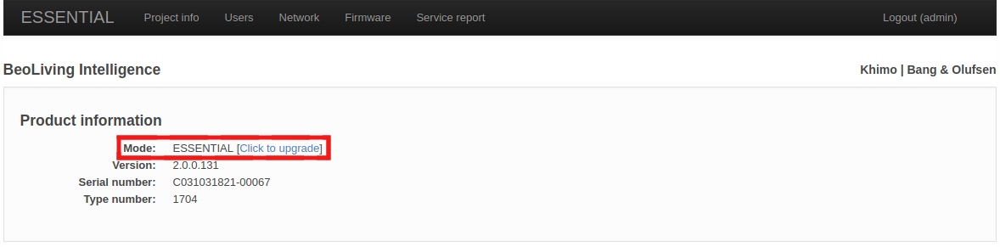
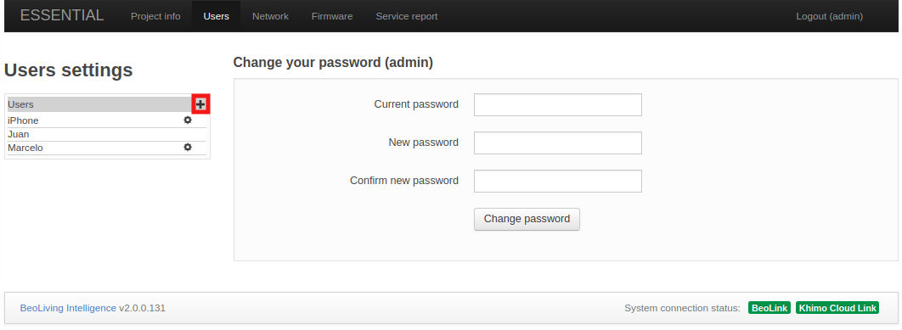
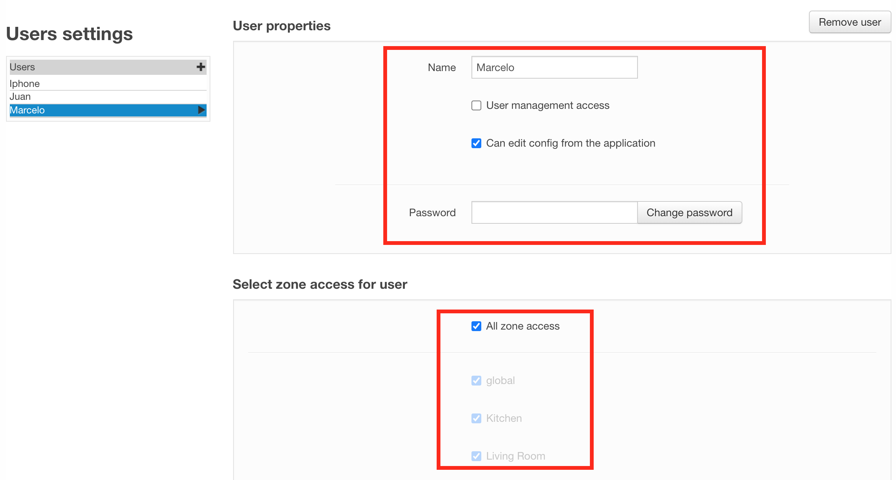
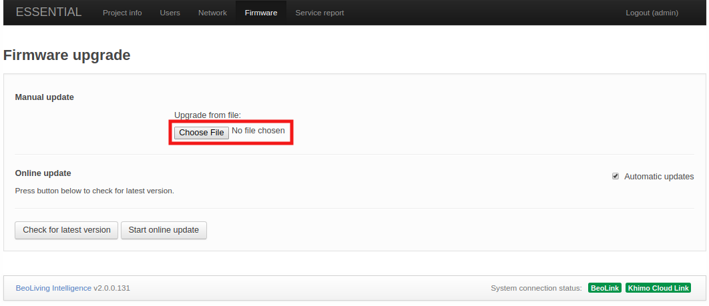
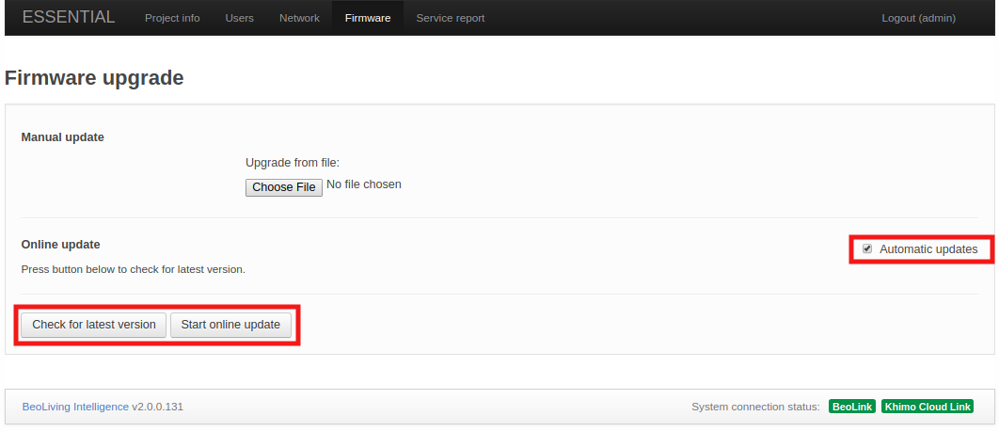

The initial page after accessing the _BLI_ via web browser shows two buttons: _WEBPANEL_ and _SETUP_.

  

+ **WEBPANEL**: This interface offers home automation control of your setup. Control of _NetworkLink_ products is not supported, only Scenes can be fired. With the _BLI_ in _PRO_ mode, it's possible to control your whole installation.
+ **SETUP**: This interface is used for configuring/programming your _BLI_ setup.

### Setup interface {#setup-interface}

The Setup web interface for the _BLI ESSENTIAL_ does not offer a high degree of customization. In fact, this interface should be used in exceptional cases, or for upgrading your _BLI_ to _PRO_ (see section [*Upgrade to PRO*](#upgrade-pro) for further information). After performing the upgrade, the Setup web interface becomes the most important tool for configuring and programming your setup.

#### Upgrade to PRO {#upgrade-pro}

  

 

While logged in as the "_admin_" user (following the [procedure described above](#admin-sign-in)), at the top menu bar the **ESSENTIAL** access page contains information regarding your _BLI_ and _Licensing information_.
In _Product information_, the _License type_ shows the current license (ESSENTIAL OR PRO) for your _BLI_, with a link for upgrading to _BLI PRO_. This link will redirect your browser to *Khimo.com* to start the upgrade process via _PayPal_.

After the payment process finishes, your _BLI_ will be upgraded to _PRO_ mode within a minute approx.

#### Project info

<!--

  

 
-->

The Project information page shows information regarding the project _BeoLiving Intelligence_ is part of.

+ **Project name**: Name for the project.
+ **Display name**: Name shown for the _BLI_ in all the user interfaces, such as _BeoLiving App_ and _WEBPANEL_. You can set this value to something meaningful such as your family name or the house street address.
+ **Installer name**: Reference name of the installer/company in charge of this project.
+ **Installer contact**: Any type of contact information to reach the installer/company in charge of this project for future questions or comments.

#### Users

  

 

The User page displays in its left column every user that can access the _BLI_. New users can be added by _admin_ by pressing the "plus" button.

##### User properties

  

 

+ **Change user password**: this can be done only on users that were created by _admin_.
+ Enable/Disable **User management access**: when selected, the user is allowed to manage users and user rights. As a general rule, this option should be set only for the home owner.
+ Enable/Disable **Controller**: allows user to have access to _BLI_ via _BLApp_. When disabled, the only access the user has is via _WEBPANEL_.

##### Select zone access for user

In this section, you can configure the zones a selected user has access to. All zones of the installation are displayed as check boxes that enable/disable access to it. _All zone access_ means that the user can control any zone of the installation.

#### Network {#network-conf}

The Network page details the network connectivity configuration for the _BLI_.

The configurable settings are:

+ **Hostname**: Name of _BLI_ as it is found in the LAN.
+ **DHCP**: Enable/Disable _DHCP_ mode. Per factory default, _DHCP_ mode is enabled.
+ **Address**: If _DHCP_ is disabled, the static _BLI_ network address could be set in _Address_.
+ **Mask**: Network mask related to _BLI_ LAN.
+ **DNS Server**: _DNS Server_ network address in LAN.
+ **Gateway**: Gateway address in LAN.

Any change to the settings are confirmed by pressing the _Apply_ button.

### Firmware

The Firmware page allows you to check and apply updates for the _BLI_ Firmware. There are two ways to perform such updates:

+ Manually uploading a _BLI_ firmware file.
+ Online update through the Internet. 

#### Manual update

 

Press the _Choose File_ to select your local _BLI_ firmware file which will be uploaded to the _BLI_, the update process will commence immediately.

#### Online update

To perform an online update to the _BLI's_ Firmware you must ensure that it has Internet access.

 

+ **Check for latest version**: The latest official Firmware version will be displayed (if available and different from the current one).
+ **Start online update**: If a new Firmware version is available for download, this button will start the Firmware download and installation process.
+ **Automatic updates**: Enable/Disable automatic _BLI_ Firmware updates. If this option is selected, the _BLI_ firmware will be automatically kept up to date.

### Service report

When any hardware or software error is experienced it is possible to create a service report containing the necessary information about your _BLI_, this will help solve any potential issue.

You must fill the form shown in the page, which will include essential information to reproduce and fix any issue you are experiencing.

Service reports are created and downloaded when the _Download_ button is clicked.
