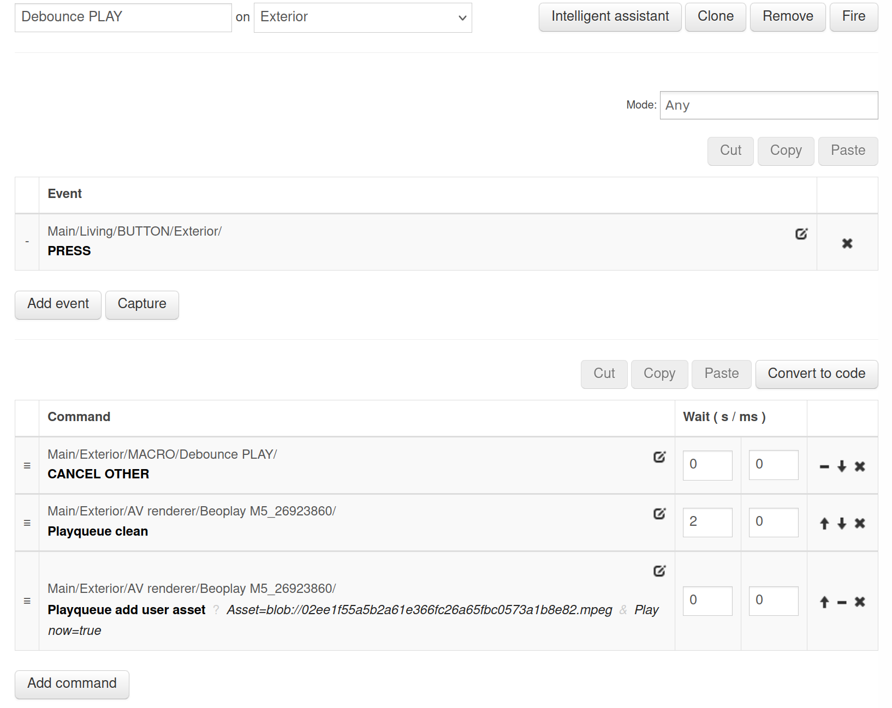

### Introduction

In home automation systems, buttons and other triggers can sometimes generate multiple signals due to physical bouncing or unstable network events, leading to unintended actions. **Debouncing is a technique used to filter out these unwanted signals and ensure that only a single, intentional action is registered.** This is particularly important during storms or other scenarios where multiple events might occur rapidly.

By implementing debouncers in your BeoLiving Intelligence setup, you can prevent erroneous commands and improve the overall user experience. This tutorial will guide you through creating macro with debounce using both table macros and Lua code, allowing you to tailor the solution to your specific needs.


### How to Implement Debouncing

Debouncing can be implemented in BeoLiving Intelligence using either table macros or Lua code. Both methods utilize the special "CANCEL OTHER" command, which cancels the execution of other instances of the same macro, except for the current instance.

**Table Macro Debouncing:**

1. Create a new macro.
2. Add the trigger event that you want to debounce, such as a button press.
3. As the first command in the macro, add the "CANCEL OTHER" command, targeting the same macro.
5. Add the commands that you want to execute after the debounce period, such as turning on a light or playing music.
4. Add a "Wait before" setting to introduce a delay before executing the desired command. This delay is the time the macro will wait to be debounced.


**Example Table Macro:**

<div class="text-center">
  
</div>

In this example, when the "Exterior" button is pressed, the macro cancels any other running instances of itself. It then waits for 2 seconds before clearing the play queue and adding a specific user asset to the Beoplay M5. If the button is pressed again within the 2-second delay, it will start a new instance of this macro, canceling the previous instance that was still waiting, and the new instance begins the debounce delay again.


**Lua Code Debouncing:**

1. Create a new Lua macro.
2. In the Lua code editor, use the `engine.fire()` function to execute the "CANCEL OTHER" command, targeting the same macro.
3. Use the `engine.delay()` function to introduce the debounce delay.
4. Add the desired commands using `engine.fire()` after the delay.

**Example Lua Code:**

```lua
function(event, engine)
  engine.fire("Main/Exterior/MACRO/Debounce PLAY/CANCEL OTHER")
  engine.delay(2,0)
  engine.fire("Main/Exterior/AV renderer/Beoplay M5_26923860/Playqueue clean")
  engine.fire("Main/Exterior/AV renderer/Beoplay M5_26923860/Playqueue add user asset?Asset=blob://02ee1f55a5b2a61e366fc26a65fbc0573a1b8e82.mpeg&Play now=true")
end
```

This Lua code achieves the same debouncing effect as the table macro example.

**When to Use Debouncing:**

Debouncing is particularly useful in situations where:

* **Buttons are prone to bouncing:** Physical buttons can generate multiple signals when pressed, especially older or less reliable buttons.
* **Network events are unstable:** Network connectivity issues or unreliable devices can lead to multiple or delayed signals.
* **A system sends a storm of events and you just want to react to the last one:** Debouncing ensures that actions are executed only once, preventing unintended consequences in scenarios where accuracy is crucial.


**Debouncing can be applied to a wide range of home automation tasks, such as controlling lights, activating scenes, adjusting volume, or triggering any other action that requires a reliable and predictable response to user interactions or events.** By incorporating debouncing techniques into your BeoLiving Intelligence setup, you can enhance the stability, accuracy, and overall user experience of your smart home.

