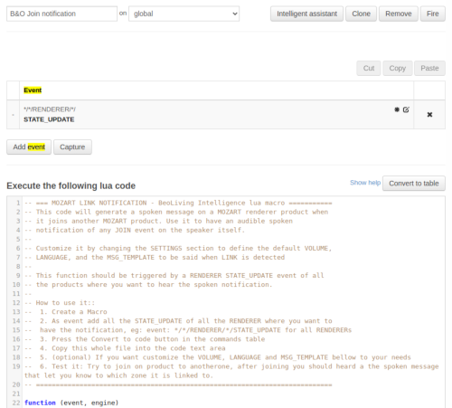

### Introduction

When you use the Join or Link functionality, it is usually hard to know where the music it is comming for, the good news is that you can use the BeoLiving Intelligence to solve that!

The Mozart Link notification is a Lua macro that generates a spoken message on a MOZART renderer product when they joins another multiroom product. This feature can be used to have an audible spoken notification of any JOIN event on the speaker itself.

### How to:

To use the Mozart Link notification, follow these steps:

1. Open the BeoLiving Intelligence admin panel.
2. Go to the Macro tab.
3. Create a new Macro.
4. Add all the STATE_UPDATE events of the RENDERERs where you want to have the notification. For example, use the event pattern `*/*/RENDERER/*/STATE_UPDATE` to include all RENDERERs.
5. Press the "Convert to code" button in the commands table.
6. Copy the entire code in "The code" section below.
7. Paste the code into the code text area of the Macro.
8. (Optional) Customize the VOLUME, LANGUAGE, and MSG_TEMPLATE according to your needs.
9. Test the macro by joining one product to another. After joining, you should hear a spoken message that indicates the zone to which it is linked.

Please note that this macro should be triggered by a RENDERER STATE_UPDATE event on all the products where you want to hear the spoken notification.




### The code
```lua
-- === MOZART LINK NOTIFICATION - BeoLiving Intelligence lua macro ===========
-- This code will generate a spoken message on a MOZART renderer product when
-- it joins another MOZART product. Use it to have an audible spoken
-- notification of any JOIN event on the speaker itself.
--
-- Customize it by changing the SETTINGS section to define the default VOLUME,
-- LANGUAGE, and the MSG_TEMPLATE to be said when LINK is detected
--
-- This function should be triggered by a RENDERER STATE_UPDATE event of all
-- the products where you want to hear the spoken notification.
--
-- How to use it::
--  1. Create a Macro
--  2. As event add all the STATE_UPDATE of all the RENDERER where you want to 
--  have the notification, eg: event: */*/RENDERER/*/STATE_UPDATE for all RENDERERs
--  3. Press the Convert to code button in the commands table
--  4. Copy this whole file into the code text area
--  5. (optional) If you want customize the VOLUME, LANGUAGE and MSG_TEMPLATE bellow to your needs
--  6. Test it: Try to join on product to anotherone, after joining you should heard a the spoken message that let you know to which zone it is linked to.
-- ===========================================================================

function (event, engine)
  -- --------------------------------------------------------
  -- SETTINGS
  -- --------------------------------------------------------

  -- Volume level for the AUDIO OVERLAY from 0 to 100:
  local VOLUME = 50

  -- International language code (e.g: en-uk, en-us, es-es)
  local LANGUAGE = "en-uk"

  -- This is the template used to create the spoken message, just change it to adapt to your language:
  -- Valid variables: $zone, $area, $name (origin product area, zone, name)
  local MSG_TEMPLATE = "Joining from $zone on $area area"

  -- --------------------------------------------------------
  -- DO NOT EDIT BELOW HERE UNLESS YOU REALLY UNDERSTAND IT!
  -- --------------------------------------------------------

  -- Extracts components from a resource string based on a specified pattern
  local function extract_resource_components(resource)
    local pattern = "([^/]+)/?"
    local matches = string.gmatch(resource, pattern)

    local components = {}
    for match in matches do
      table.insert(components, match)
    end
    return components
  end

  -- Replaces placeholder variables in a template with actual values.
  -- This function creates a message based on a predefined template and a table of components.
  local function create_message(template, components)
    local message = string.gsub(template, "$name", components[4])
    message = string.gsub(message, "$zone", components[2])
    message = string.gsub(message, "$area", components[1])
    return message
  end

  -- Constructs the command to send the audio overlay message.
  -- It combines the event resource with the overlay parameters to form a string command.
  local function construct_audio_overlay_command(event_resource, volume, language, message)
    local cmd = event_resource .. "/AUDIO_OVERLAY_TEXT?"
    local attrs = {}
    table.insert(attrs,"VOLUME=" .. volume or  "50")
    table.insert(attrs,"LANGUAGE=" .. language or "en-uk")
    table.insert(attrs,"TEXT=" .. message)
    return cmd .. table.concat(attrs,"&")
  end

  if (event.updated("SELECTED_SOURCE")) then
    Error("DOMEONE")
    local selected_source = event.get_string("SELECTED_SOURCE")

    -- Create the address of the resource from the event origin
    local event_resource = event.area() .. "/" .. event.zone() .. "/RENDERER/" .. event.name()
    if (selected_source ~= event_resource) then

      local components = extract_resource_components(selected_source)

      local message = create_message(MSG_TEMPLATE, components)

      local command = construct_audio_overlay_command(event_resource, VOLUME, LANGUAGE, message)

      -- Delay the command to ensure the product is ready
      engine.delay(0, 200)

      -- Send the audio overlay message to the address with the now_playing  
      engine.fire(command)
    end
  end
end
```

### Customize Settings

You can customize the macro by changing the SETTINGS section. This allows you to define the default VOLUME, LANGUAGE, and the MSG_TEMPLATE to be said when a LINK event is detected.

