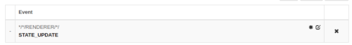

### Introduction

When you select a radio in a Bang & Olufsen product, using a remote control or the frontpanel buttons, it is hard to know which radio you was sintonized without looking at the App, **now you can solve that with this simple BeoLiving Intelligence automation**, use the instructions provided below you will make the B&O products read aloud the station name as soon as a station start playing. 

It is possible to add this to any Mozart (Control Link) product or just select some of them. The read message could be customized to use your own languange and words.

### How to set it up

To use setup the the Mozart B&O radio notification, follow these steps:

1. Open the BeoLiving Intelligence admin panel.
2. Go to the Macro tab.
3. Create a new Macro.
4. Add all the STATE_UPDATE events of the RENDERERs where you want to have the notification. For example, use the event pattern `*/*/RENDERER/*/STATE_UPDATE` to include all Mozart products of the setups:  (*)
5. Press the "Convert to code" button in the commands table.
6. Copy the entire code in "The code" section below.
7. Paste the code into the code text area of the Macro.
8. (Optional) Customize the VOLUME, LANGUAGE, and MSG_TEMPLATE according to your needs.
9. Test the macro by selecting a B&O Radio station. After selecting, you should hear a spoken message that indicates the name of the B&O Radio station.

**(*)** Please note that this macro will add the functionality to ANY product that you add to the list of event on step 4, as the status change will fire the automation in the same RENDERER that changed the status. 

### The macro lua code
```lua
-- === MOZART B&O RADIO SELECTED NOTIFICATION - BeoLiving Intelligence lua macro ==
-- This code will generate a spoken message on a MOZART renderer product when
-- the nowPlaying is changed. Use it to have an audible spoken notification on
-- every netRadio change
--
-- Customize it by changing the SETTINGS section to define the default VOLUME,
-- LANGUAGE, and the MSG_TEMPLATE. 
--
-- This function should be triggered by a RENDERER STATE_UPDATE event of all
-- the products where you want to hear the spoken notification.
--
-- How to use it::
--  1. Create a Macro
--  2. As event add all the STATE_UPDATE of all the RENDERER where you want to
--  have the notification, eg: event: */*/RENDERER/*/STATE_UPDATE for all
--  RENDERERs
--  3. Press the Convert to code button in the commands table
--  4. Copy this whole file into the code text area
--  5. (optional) If you want customize the VOLUME, LANGUAGE and MSG_TEMPLATE
--  bellow to your needs
--  6. Test it: Try select a new netRadio source, after that you should heard a
--  the spoken message telling you the name of the
--  station.
--  ===========================================================================

function (event, engine)
  -- --------------------------------------------------------
  -- SETTINGS
  -- --------------------------------------------------------

  -- Volume level for the AUDIO OVERLAY from 0 to 100:
  local VOLUME = 50

  -- International language code (e.g: en-uk, en-us, es-es)
  local LANGUAGE = "en-uk"

  -- Message template for the spoken text:
  local MSG_TEMPLATE = "Playing $radio" -- Always include the placeholder "$radio"m the BLI will remplace it with the name of the selected radio.

  -- --------------------------------------------------------
  -- DO NOT EDIT BELOW HERE UNLESS YOU UNDERSTAND THE CODE!
  -- --------------------------------------------------------

  -- Constructs the command to send the audio overlay message.
  local function construct_audio_overlay_command(event_resource, volume, language, message)
    return event_resource .. "/AUDIO_OVERLAY_TEXT?VOLUME=" .. volume .. "&LANGUAGE=" .. language .. "&TEXT=" .. message
  end

  -- Creates the spoken message based on the template and the selected radio station.
  local function create_message(template, selected_radio)
    return string.gsub(template, "$radio", selected_radio)
  end

  -- The main function that should be triggered by an event.
  if (event.updated("NOW_PLAYING") and event.get_string("INPUT") == "netRadio") then
    -- Get the current now playing radio station text
    local selected_radio = event.get_string("NOW_PLAYING")

    -- Create the address of the resource based on the event origin
    local event_resource = event.area() .. "/" .. event.zone() .. "/RENDERER/" .. event.name()

    -- Create the spoken message using the message template
    local message = create_message(MSG_TEMPLATE, selected_radio)

    -- Construct the command to send the audio overlay message
    local command = construct_audio_overlay_command(event_resource, VOLUME, LANGUAGE, message)

    -- Send the audio overlay message to the resource address with the now playing information
    engine.fire(command)
  end
end

```

### Customize Settings

You can customize the macro by changing the variables defined in the SETTINGS section of the lua code, aallowing you to define the default VOLUME, LANGUAGE, and the message (MSG_TEMPLATE) to be said when a radio is selected.

