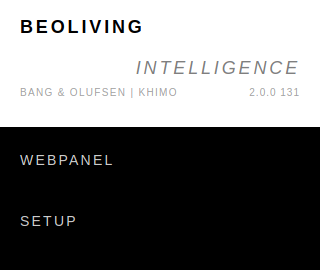
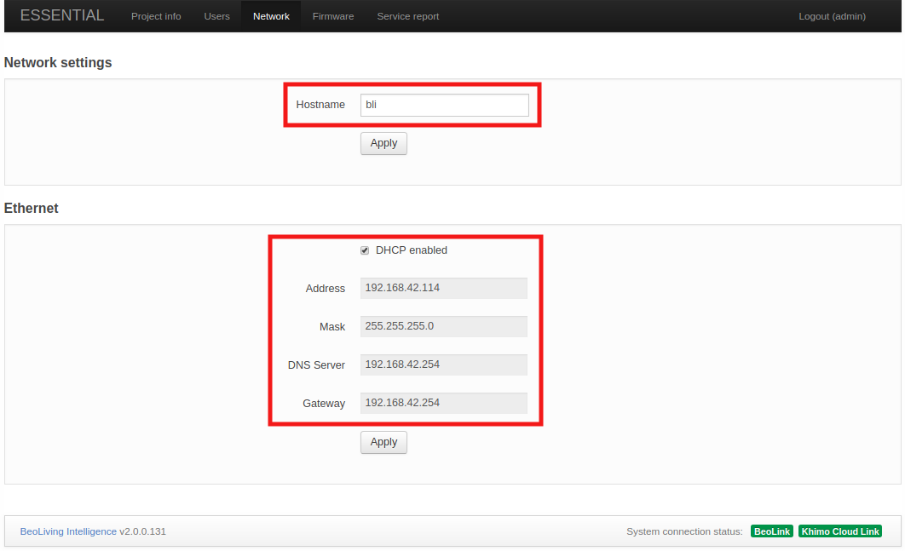

## Introduction

This guide provides:
- A description of all elements that come inside a _BeoLiving Intelligence_ box.
- How to find and access _BeoLiving Intelligence_ within the network.
- An overview of different sections of its web interface in _ESSENTIAL_ mode.
- How to upgrade your _BeoLiving Intelligence_ to _PRO_ mode.

Most of _BeoLiving Intelligence_ configuration and usage in _ESSENTIAL_ mode it's done through the _BeoLiving App_. This Smart Device application lets
 you customize your installation and control all devices in it. _BeoLiving Intelligence_ also provides a web interface, which out of the box 
provides Network settings and User access control management. After upgrading your controller to _BeoLiving Intelligence PRO_, the web interface 
becomes the most important tool for installation, configuration and programming. 

## Terminology

+ _BeoLiving Intelligence ESSENTIAL_: BeoLiving Intelligence in _ESSENTIAL_ mode.
+ _BeoLiving Intelligence PRO_: BeoLiving Intelligence in _PRO_ mode.
+ _BLI_: Alias for BeoLiving Intelligence.
+ _BLI ESSENTIAL_: Alias for BeoLiving Intelligence _ESSENTIAL_.
+ _BLI PRO_: Alias for BeoLiving Intelligence _PRO_.
+ _BLApp_: BeoLiving App.
+ _LAN_: Local Area Network.
+ _DHCP_: Dynamic Host Configuration Protocol.
+ _PoE_: Power over Ethernet.

## What's inside the box

After opening the box of _BLI_ you will find:

+ _BLI_ hardware.
+ Wall bracket for _BLI_.
+ AC power supply.
+ Quick setup guide.

## _BeoLiving Intelligence_ hardware description

### Connection Panel

Located on the back of the _BLI_:

+ *Power*: Powers the _BLI_. 
+ *USB Port*: Used for service purposes.
+ *System Reset Button*: Press it for 8 seconds for resetting the system.
+ *RJ 45 Connector*: For connecting the BeoLiving Intelligence to a local network (*PoE* capable). 

### User Led and Button

+ *User LED*: The user LED is used to signalize the current state of the _BLI_, using different colours and ON-OFF patterns combination. Colours could be Green, Red or Yellow and the patterns could be Solid, Flash and Quick Flash. For more information about different _BLI_ LED states refer to [*Led States*](#led-states) section.
+ *User Button*: This button is intended for user confirmation and button function input. For more information refer to [Button Functions](#button-functions) section.

  

### Led States

All the possible user LED states with their respective meaning are shown in the following table.

<table class="table">
  <thead class="thead-light">
    <tr>
      <th scope="col">Activity</th>
      <th scope="col">LED state</th>
    </tr>
  </thead>
  <tbody>
    <tr>
      <td>Normal operation</td>
      <td>Solid Green</td>
    </tr>
    <tr>
      <td>Critical error</td>
      <td>Red / Yellow flash</td>
    </tr>
    <tr>
      <td>Firmware update</td>
      <td>Green quick flash</td>
    </tr>
    <tr>
      <td>Loading configuration</td>
      <td>Green quick flash</td>
    </tr>
    <tr>
      <td>Waiting for User confirmation</td>
      <td>Green / Yellow quick flash</td>
    </tr>
    <tr>
      <td>User confirmation acknowledge</td>
      <td>Solid Yellow</td>
    </tr>
    <tr>
      <td>Boot</td>
      <td>Red / Yellow transition</td>
    </tr>
  </tbody>
</table>

## Accessing the BeoLiving Intelligence

The _BLI_ presents a web interface that can be accessed from a network browser. By default, _BLI_ is configured on DHCP mode,
meaning that it gets the IP address from the router it is connected to.

### IP address discovery suggestions

- Look up for "\_hipservices.\_tcp" using an application that supports Zero-configuration, such as the Safari browser or the avahi-browse command.
- Use a network scanner/IP-scanner (e.g. Fing) on the same network as the _BLI_.
- Access your LAN router and search for the assigned IP to _BLI_. 

### Set static IP address mode

A static IP-address can be set to the _BLI_ by accessing through the web interface, as described in the [*Network*](#network-conf) section.

### Direct access

The _BLI_ can be set to the factory default IP-address *192.168.1.10* by activating the Setup button function (3); see [Button Functions](#button-functions). 
Once this address is set, you can access it directly using a network browser and an Ethernet crossover cable. Note that he computer must
have an IP address in the same range, e.g. 192.168.1.11 with subnet mask 255.255.255.0.

## User button {#button-functions}

_BLI_ has a button accessible in the upper side which provides several functions during normal operation:

- **Function 1**: Reserved.
- **Function 2**: Set _admin_ password to _"admin"_, which will be valid for the next 5 minutes. Check the [*Setup interface*](#setup-interface) section for further information.
- **Function 3**: Set network settings to fixed IP (192.168.1.10).
- **Function 4**: Set network settings to use DHCP.
- **Function 5**: Erase all configuration and settings.

To execute a function, press and hold the setup button. This will cycle through all available functions as indicated by the LED blinking (it will blink once for function 1, after a while it will blink twice for function 2 and so on).

Release the button when you get to the desired function number, where the LED will start to blink waiting for a confirmation. Press the setup button again in order to confirm the function execution.

In addition to being used to confirm the input function, a single press during normal operation is used to fire System events (refer to [_BeoLiving Intelligence PRO User Guide_](bli-pro-user-guide.md)).

## Web interface usage

The initial page after accessing the _BLI_ via web browser shows two buttons: _WEBPANEL_ and _SETUP_.

  

+ **WEBPANEL**: This interface offers home automation control of your setup. Control of _NetworkLink_ products is not supported, only Scenes could be fired. When the _BLI_ is on _PRO_ mode, it is be possible to control all your installation.
+ **SETUP**: This interface is used for configuring/programming your _BLI_ setup.

### Setup interface {#setup-interface}

The Setup web interface of _BLI ESSENTIAL_ does not offer a high degree of customization. In fact, this interface should be used in exceptional cases, or for upgrading your _BLI_ to _PRO_ (see section [*Upgrade to PRO*](#upgrade-pro) for further information). After performing the upgrade, the Setup web interface becomes the most important tool for configuring and programming your setup.

An installer can access the _BLI_ setup interface with the _admin_ user, which has an unknown password by default. The Setup function 2 can be used for setting the _admin_ password to _"admin"_ for 5 minutes, and the _BLI_ will request a password update as soon as the web interface is accessed.

#### Upgrade to PRO {#upgrade-pro}

At the top menu bar, the **ESSENTIAL** access page contains information regarding your _BLI_ and _Licensing information_ (mode).
In _Product information_, the _License type_ shows the current license (mode) of your _BLI_, with a link for upgrading to _BLI PRO_. This link will redirect your browser to *Khimo.com* to start the upgrade process via _PayPal_.

After the payment process finishes, your _BLI_ will be upgraded to _PRO_ mode within a minute approximately.

#### Project info

The Project information page shows information regarding the project _BeoLiving Intelligence_ is part of.

+ **Project name**: Name for the project.
+ **Display name**: Name of the _BLI_ that will be shown in all the user interfaces, such as _BeoLiving App_ and _WEBPANEL_. You can set this value to something meaningful such as your family name or the street address of the house.
+ **Installer name**: Reference name of the installer/company in charge of this project.
+ **Installer contact**: Any type of contact information to reach the installer/company in charge of this project for future questions or comments.

#### Users

The Users page shows in the left column every user that can access the _BLI_. New users can be added by _admin_ by pressing the "plus" button.

##### User properties

+ **Change user password**: this can be performed only on users that were created by _admin_.
+ Enable/Disable **User management access**: when selected, the user is allowed to manage users and user rights. As a general rule, this option should be set only for the home owner.
+ Enable/Disable **Controller**: allows user to have access to _BLI_ via _BLApp_. When disabled, the only access the user has is via _WEBPANEL_.

##### Select zone access for user

In this section, you can configure the zones the selected user has access to. All zones of the installation are displayed as checkboxes that enable/disable access to it. _All zone access_ means that the user can control any zone of the installation.

#### Network {#network-conf}

The Network page contains the network connectivity configuration of _BLI_.

The configurable setting are:

+ **Hostname**: Name of _BLI_ as it is found in the LAN.
+ **DHCP**: Enable/Disable _DHCP_ mode. Per factory default, _DHCP_ mode is enabled.
+ **Address**: If _DHCP_ is disabled, the static _BLI_ network address could be set in _Address_.
+ **Mask**: Network mask related to _BLI_ LAN.
+ **DNS Server**: _DNS Server_ network address in LAN.
+ **Gateway**: Gateway address in LAN.

Any change to the settings are persisted by pressing the _Apply_ button.

### Firmware

The Firmware page allows you to check and apply updates for the _BLI_ Firmware. There are two ways to perform such updates:

+ Manually uploading a _BLI_ firmware file.
+ Online update through the Internet. 

#### Manual update

Press the _Choose File_ to select your local _BLI_ firmware file, which will be uploaded to the _BLI_, beginning the update process immediately.

#### Online update

For performing an online update to the _BLI_ Firmware you must ensure that it has Internet access.

+ **Check for latest version**: After pressed, the lastest official Firmware version will be displayed, if available and different from the current one.
+ **Start online update**: If a new Firmware version is available for download, pressing this button will start the Firmware download and installation process.
+ **Automatic updates**: Enable/Disable automatic _BLI_ Firmware updates. If this option is selected, then the _BLI_ firmware will be automatically kept up to date.

### Service report

When any hardware or software error is experienced it is possible to create a service report containing the necessary information about your _BLI_, which will help in solving any potential issue.

You must fill the form shown in the page, which will include essential information to reproduce and fix any issue you are experiencing.

Service reports are created and downloaded when _Download_ button is clicked.
