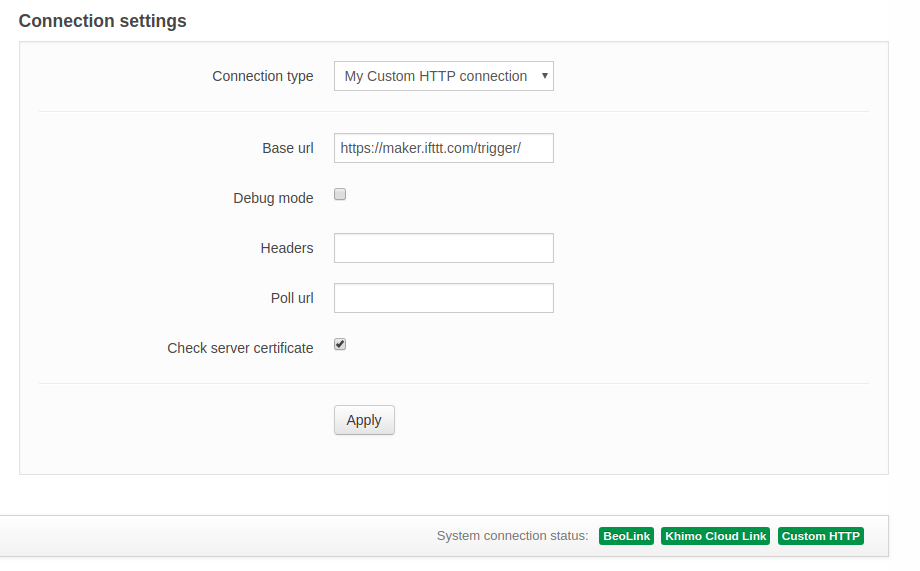
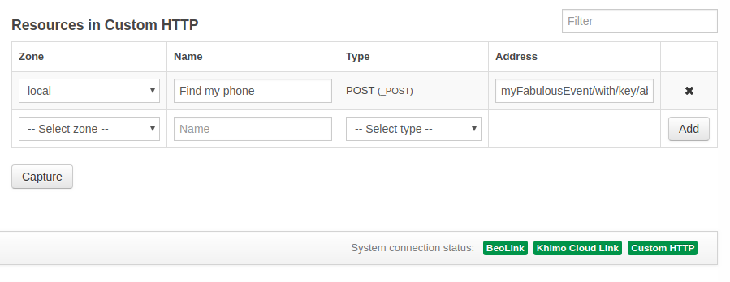
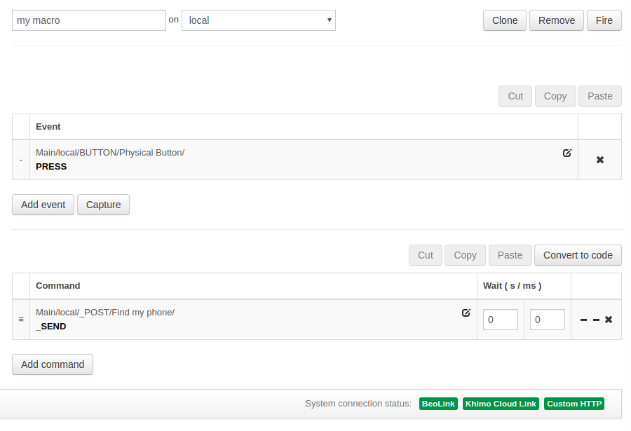

_BeoLiving Intelligence_ is capable to fire **IFTTT applets** in a really simple way. This tutorial will show you the configuration process by 
showing an example of how to find your phone just by pressing a wall button.

Basically, _BeoLiving Intelligence_ will trigger your **Applet** by sending a POST HTTP request to an specific URL. Depending on the trigger 
selected a body message with an specific format will be needed or not. To fire HTTP requests with _BeoLiving Intelligence_ _Custom HTTP_ driver 
must be configured correctly to fire all **Applets** you want with multiple requests. 

# Creating your IFTTT applet with Webhooks as a service

To create your **Applet** follow the next instructions: 

- Choose **Webhooks** as a service (the one that will trigger your Applet).
- Select "_Receive a web request_" as a trigger.
- Set an "_Event name_" that will identify your trigger.
- Select the action of your **Applet**. Depending on the action selected, a _JSON_ body on the POST HTTP sent by _BeoLiving Intelligence_ 
should be added. For the example showed in this document select the action "_VoIP Calls_" (_IFTTT_ application must be installed in your phone).
- To know the URL that will fire your **Applet** its necessary to visit the [IFTTT Webhook documentation](https://ifttt.com/maker_webhooks) and 
go to "_Documentation_". The trigger URL will be shown. "_{event}_" value should be equal to the _Event name_ you chose at point 3. Also the 
optional JSON body is showed mentioned at point 4.

# Configuring Custom HTTP driver on BeoLiving Intelligence

Enter to the web-interface of _BeoLiving Intelligence_ and follow the next steps:

- Add _Custom HTTP_ system.
- At "_Connection settings_" of _Custom HTTP_ driver insert constant prefix of your **Applet** trigger URL as the _Base Url_. For example, if the 
URL is _https://maker.ifttt.com/trigger/myFabulousEvent/with/key/abcDFgHijK_, insert just _https://maker.ifttt.com/trigger/_.

  

- Go to _Resources_ and add a "_POST_" resource with the rest of the URL at the resource address. For example, address equal 
"_myFabulousEvent/with/key/abcDFgHijK_". Add as many resources as **Applets** you desire to fire. If it's necessary (depending on your Applet) add
 the body of the request (check _Custom HTTP_ system help for more information). In our case of the **Applet** that it's being described in this 
tutorial, body request is not necessary.

  

- Create a _Macro_ setting a _SEND_ command on the _Custom HTTP_ resource created at 4. Add the _Event_ you prefer. In our example, this could be
 any physical button of your configuration. After pressing this button, the HTTP request will be fired and your phone will start ringing.

  

