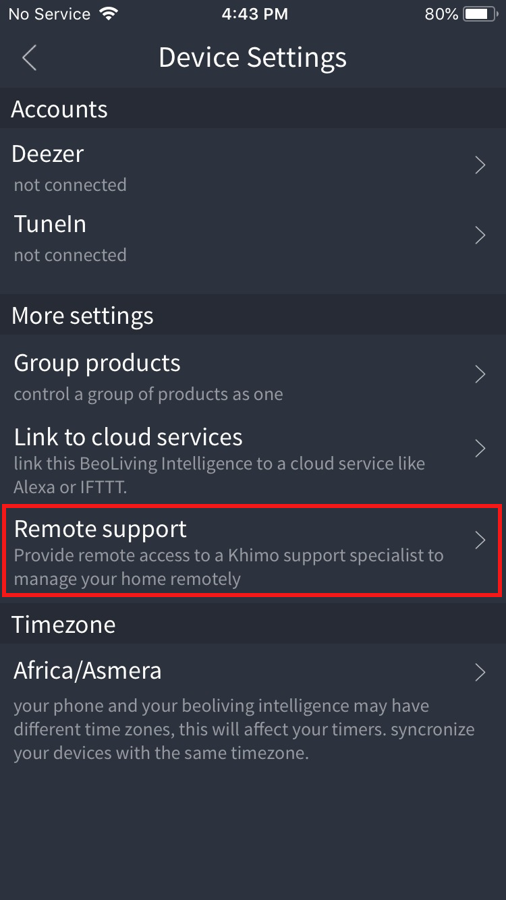
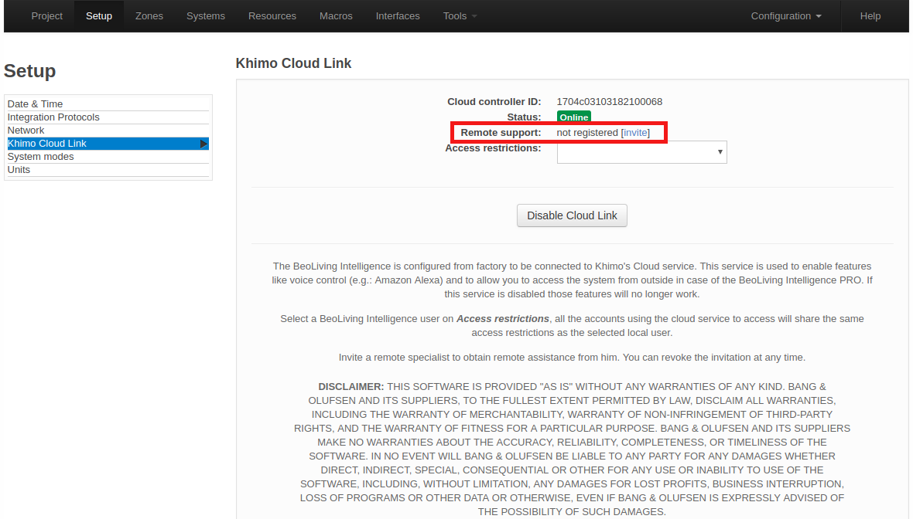
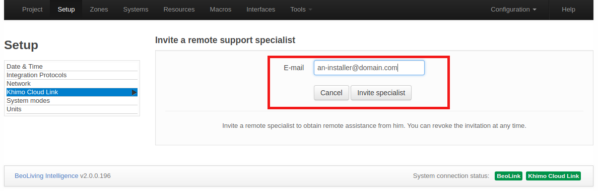
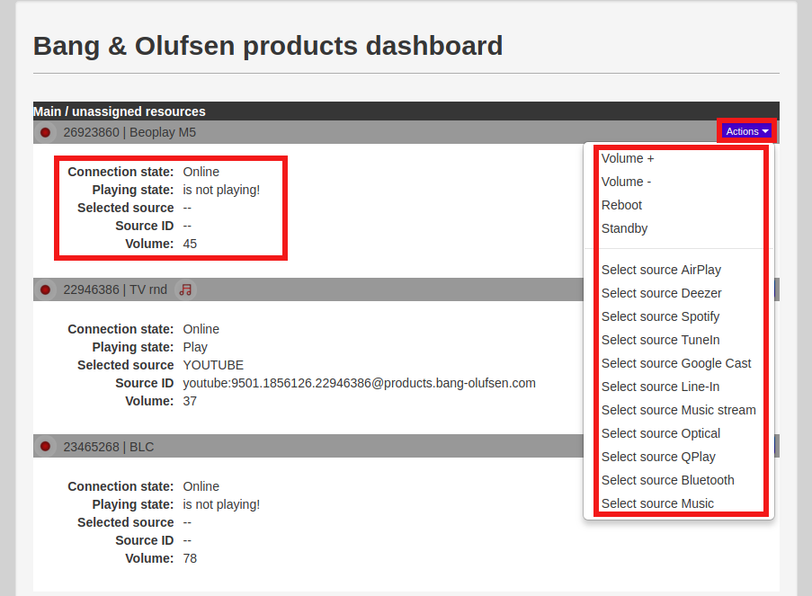

In BeoLiving Intelligence, the new role of "**Remote Support Specialist**" is introduced. The purpose of this specialist is to remotely support all 
_Bang & Olufsen's NetworkLink_ products during installation and other general support needs.

## Invite the specialist

There are two ways to invite a _Remote Support Specialist_ in _BeoLiving Intelligence_: through the _BeoLiving App_ or through the setup web interface (_PRO_ only).

Once the invitation is accepted a remote specialist can access the project by logging in to [Khimo.com/installer](https://www.khimo.com/installer).

### Invite through BeoLiving App

Through _BeoLiving App_, an invitation can be sent by going to the _Device Settings_ of the _BeoLiving Intelligence_. Go to _Remote support_ entry, as the following image shows.

  

 

Insert the remote support specialist's email and click on _Invite_.

  

 

After accepting the invitation, the installer can visualize the project at [Khimo.com](https://www.khimo.com/installer), being able to control and check the state of all devices.

### Invite through setup web-interface | _PRO_ only

Invitation through the web-interface for a _BeoLiving Intelligence_ in _PRO_ mode is done at **Setup > Khimo Cloud Link**.

  

 

By clicking on "**invite**" you can send the invitation email to the remote specialist.

  

 

## State monitoring and support actions

After logging into [Khimo.com/installer](https://www.khimo.com/installer), the remote suport specialist will be able to check the following information on the available _NetworkLink_ devices:

+ _Connection state_: Displays if the device is online or offline.
+ _Playing state_: Shows the current playing state of the device.
+ _Selected source_: Displays the source being played by the device, if any.
+ _Source ID_: Displays the Source identifier of the source being played by the device.
+ _Volume_: Shows the volume level of device.

  

 

The remote support specialis will be able to perform the following actions on the devices:

+ _Increase or decrease volume_.
+ _Put the device in standby_.
+ _Reboot the device_ (as long the device supports reboots).
+ _Select a source on the device_.

## Remote Access to Admin Panel via Khimo Cloud Link (Configuration Tunnels)

Remote Support Specialists can also access the BeoLiving Intelligence admin panel remotely using the Khimo Cloud Link and configuration tunnels. This allows the remote support specialists (installer) to access the admin webpage without being onsite.

1. **Accessing the Khimo Cloud Link:** As a designated Remote Support Specialist, log in to [Khimo Installer](https://www.khimo.com/installer). You will find the BeoLiving Intelligence unit listed under the projects you have access to, searchable by its serial number.

2. **Opening the Remote Access Tunnel:** Once you've located the correct unit, press the "Help" button for more details. Then, press the **"Open"** button in the **Tunnel** section to request the BLI to open the tunnel port. This initiates a request for a **secure** configuration tunnel from the cloud to the BLI.

3. **Automatic or On-Site Confirmation:**

   * The BLI is configured by default to request on-site confirmation before allowing an installer to access the BLI remotely. In this case, a message will appear in Khimo, indicating that someone needs to physically press the button on the BeoLiving Intelligence unit to authorize access. During this time, the BLI will be blinking, and a local user should press the button to authorize the creation of the remote tunnel.
   * As the installer, you can configure a BLI to automatically accept the tunnel request without local user interaction. You must only do this if you have the homeowner's authorization. Please be aware that by enabling this option, you are fully responsible for any unauthorized access. If the BLI is configured to automatically open the tunnel, the **Open** tunnel will just open a new window with access to the BLI web panel from the cloud.

4. **Gaining Remote Access:** Once the tunnel is open (either automatically or after on-site confirmation), you will have full remote access to the BeoLiving Intelligence web panel, allowing you to perform advanced configuration and support tasks.

Check the following video for more details and examples of how to use the configuration tunnel:

<iframe width="560" height="315" src="https://www.youtube.com/embed/3bPAtWAuDpA?si=mwm2a-4gn4LhUTyv" title="YouTube video player" frameborder="0" allow="accelerometer; autoplay; clipboard-write; encrypted-media; gyroscope; picture-in-picture; web-share" referrerpolicy="strict-origin-when-cross-origin" allowfullscreen></iframe>
