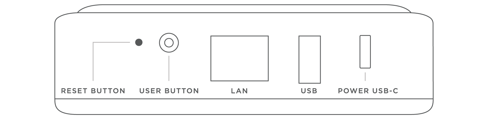

<h2> 
<a href="https://github.com/gcastroolmedo/gcastroolmedo.github.io/files/10746380/Beoliving_Intelligence_specs-3gen.pdf" title="Download"><i class="fa fa-arrow-circle-down  fa-2x"></i></a>
  Hardware specifications - Generation 3 </h2>

 

<table class="table">
  <thead>
    <tr style="color: #eb5946">
      <th scope="col" style="width: 40%">Feature</th>
      <th scope="col" >Description</th>
    </tr>
  </thead>
  <tbody>
    <tr>
      <td>Connectivity</td>
      <td>
        <ul>
          <li>Ethernet </li>
          <li>USB 2.0 (500 mA @ 5 V)</li>
        </ul>
      </td>
    </tr>
    <tr>
      <td>Power</td>
      <td>
        <ul>
          <li>5V, 3A USB-C connector</li>
        </ul>
      </td>
    </tr>
    <tr>
      <td>Accessories included in the box</td>
      <td>
        <ul>
          <li>5V, 3A (10W) AC/DC Wall Adapter</li>
          <li>Wall/Ceiling Bracket</li>
          <li>US, UK, AU and EU plug adapters</li>
        </ul>
      </td>
    </tr>
    <tr>
      <td>Temperature Range</td>
      <td>
        <ul>
          <li>Operating: -10°C to 60°C</li>
          <li>Storage: -40°C to 85°C</li>
        </ul>
      </td>
    </tr>
    <tr>
      <td>Dimensions</td>
      <td>
        <ul>
        <li> Weight: 195 gr </li>
        <li>Length: Length: 12 cm </li>
        <li>Width: 12 cm </li>
        <li>Height: 3,2 cm </li>
        </ul>
      </td>
    </tr>
    <tr>
      <td>RTC</td>
      <td>
        <ul>
        <li>Real time clock</li>
        </ul>
      </td>
    </tr>
  </tbody>
</table>

## Connection Panel - Generation 3

Located at the back of the _BLI_:

+ *System Reset Button*: Press & hold for 8 seconds to *reboot* the system.
+ *User Button*: This button is intended for user confirmation and button function input. For more information refer to [Button Functions](_bli_advanced_user_guide/05-user_button.md) section. 
+ *LAN Connector*: For connecting the BeoLiving Intelligence to a local network. 
+ *USB Port*: The USB port can be used for connections via RS232 or for service purposes.
+ *Power USB-C*: Powers the BLI.

 
**Please note that BeoLiving Intelligence generation 3 can be only powered by the *USB-C connector***

**To download the Beoliving Intelligence generation 1 specifications please refer to the [Beoliving Intelligence Generation 1 file](https://github.com/gcastroolmedo/gcastroolmedo.github.io/files/10746378/Beoliving_Intelligence_specs-1gen.pdf)**
