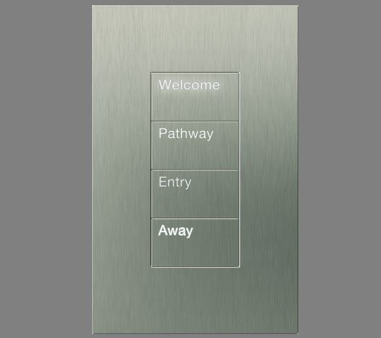
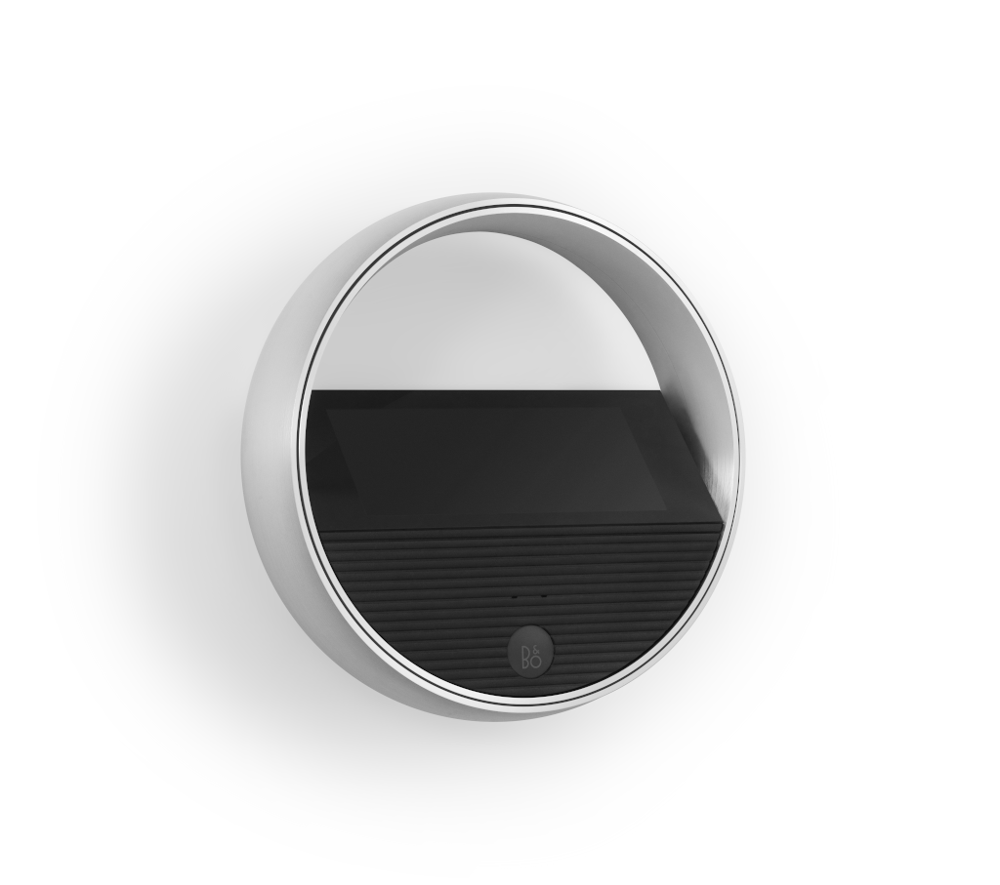
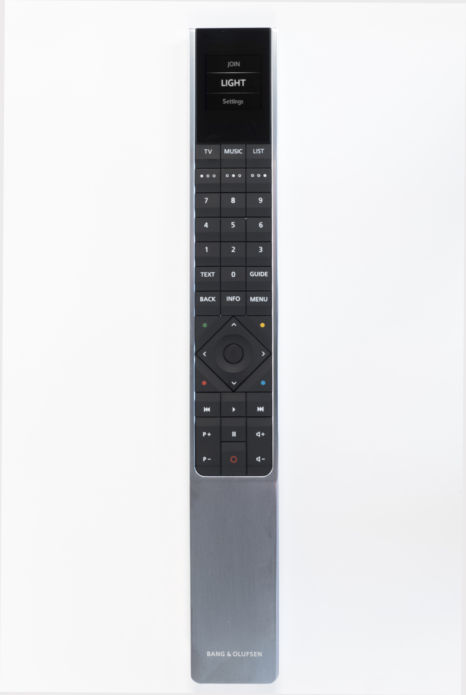

[comment]: <> (Para una nueva diapositiva horizontal use: \n----\n)
[comment]: <> (Para una nueva diapositiva vertical use: \n|||n)
[comment]: <> (Para escribir notas de diapositivas use \nNote:)

## BeoLiving Intelligence
<!-- .slide: data-background-image="./res/shape.jpg" data-background-opacity="0.3" data-background-color="#f1574b" -->

##### por Khimo y Bang & Olufsen

 
<small>Integraciones simples que funcionan</small>

---

## ¿Qué Significa Bang & Olufsen en la Industria AV?

<!-- .slide: data-background-image="./res/shape.jpg" data-background-opacity="0.3" data-background-color="#f1574b" -->

---

## ¿Qué es Bang & Olufsen en la Industria de la Automatización del Hogar?

<!-- .slide: data-background-image="./res/shape.jpg" data-background-opacity="0.3" data-background-color="#f1574b" -->

---

<!-- .slide: data-background-image="./res/shape.jpg" data-background-opacity="0.3" data-background-color="#f1574b" -->
### B&O es el único jugador AV que: 

- ofrece una **solución completamente integrada**.

- permite **integraciones significativas** en menos de **5 minutos** de configuración.

---

<!-- .slide: data-background-image="./res/jean.jpg" data-background-opacity="0.2" data-background-color="#f1574b" -->

### BeoLiving Intelligence

###### por Khimo y Bang & Olufsen
<small>integraciones que funcionan</small>

---

## REALMENTE SIMPLE DE CONFIGURAR:
<!-- .slide: data-background-image="./res/jean.jpg" data-background-opacity="0.3" data-background-color="#f1574b" -->

1. Definir las Zonas
1. Conectar al sistema de terceros
1. Cargar los recursos en cada zona
1. Listo

---

## REALMENTE SIMPLE DE CONFIGURAR:

<!-- .slide: data-background-image="./res/jean.jpg" data-background-opacity="0.3" data-background-color="#f1574b" class="container" -->

<iframe width="700" height="515" src="https://www.youtube.com/embed/FXQ7Jgaq1dU?si=FQe_y2xDKxErVLAa" title="Reproductor de video de YouTube" frameborder="0" allow="accelerometer; autoplay; clipboard-write; encrypted-media; gyroscope; picture-in-picture; web-share" referrerpolicy="strict-origin-when-cross-origin" allowfullscreen></iframe>

<small>Todas las interfaces están pobladas y listas para usar en menos de 80 segundos!</small>

---

## FÁCIL DE AUTOMATIZAR: Macros
<!-- .slide: data-background-image="./res/jean.jpg" data-background-opacity="0.3" data-background-color="#f1574b" -->

Una macro es una **Lista de eventos** que desencadena 
  una lista ordenada de **comandos**

---

## FÁCIL DE AUTOMATIZAR: Editor
<!-- .slide: data-background-image="./res/jean.jpg" data-background-opacity="0.3" data-background-color="#f1574b" -->

<video data-autoplay controls width=650 src="./res/macro_lights_beoremote.webm"></video>

---

## FÁCIL DE AUTOMATIZAR: IA
<!-- .slide: data-background-image="./res/jean.jpg" data-background-opacity="0.3" data-background-color="#f1574b" -->

<video data-autoplay controls width=650 src="./res/ai.webm"></video>
<small>El asistente de IA podría hacer las macros por ti</small>

---

## PODEROSO CUANDO LO NECESITAS
<!-- .slide: data-background-image="./res/jean.jpg" data-background-opacity="0.3" data-background-color="#f1574b" -->

<video data-autoplay controls width=650 src="./res/lua_toggle.webm"></video>
<small>Si puedes imaginarlo, puedes programarlo</small>

---

## 2 sabores:
<!-- .slide: data-background-image="./res/jean.jpg" data-background-opacity="0.3" data-background-color="#f1574b" -->

 

Essential <small> nivel de entrada </small> 

 

PRO <small> para el profesional </small>
 <!-- .element: class="fragment" data-fragment-index="2" -->

Note:
  - Essential: Un controlador de hogar de entrada (De fábrica) 
  - PRO: BeoLink Gateway + acceso remoto gratuito + nuevas funcionalidades (debe comprar una actualización) 

----
### Essential <small>Nivel de entrada</small>
<!-- .slide: data-background-image="./res/alone.jpg" data-background-opacity="0.2" data-background-color="#f1574b" -->

- Plug & Play
- Configuración desde la **Aplicación BeoLiving**
- Asistentes de **voz**
- Philips Hue
- B&O - **AV y Halo**
- Cámaras ONVIF
- *Grupos de productos*

Note:
BLI está diseñado para el usuario final. Fuera de la caja, podría ser configurado por algunos pasos fáciles no técnicos.

----

### PRO 
<!-- section.present css
<!-- .slide: class="whiteBack" data-background-image="./res/building.jpg" data-background-opacity="0.2" data-background-color="#f1574b" -->

- Panel de administración en tiempo real   <small>Programación de macros, asistente de IA, Multiusuario, Tiempo real</small>
- Cientos de controladores de dispositivos  <small>(Lutron, KNX, Fibaro, Shelly, ...)</small>
- Acceso remoto <small>Usa la aplicación desde fuera de tu hogar</small>

Note:
- Pagando por una actualización de licencia PRO única, BLI desbloqueará el resto de sus capacidades. La forma de pagar esta licencia se puede hacer a través de la interfaz web de BLI BASIC. En el futuro se planea agregar una forma de actualizar a PRO a través de la Aplicación BeoLiving.
- Además de la zona "global", ahora hay una zona predeterminada más llamada "recursos-no-asignados" donde se agregan todos los dispositivos NetworkLink.

---

<!-- .slide: data-background-image="./res/pattern_soft.jpg" data-background-opacity="0.6" data-background-color="#f1574b" -->
## Casos de Uso
## Soluciones Simples Que Marcan la Diferencia

---

<!-- .slide: data-background-image="./res/living.jpg" data-background-opacity="0.6" data-background-color="#f1574b" -->
##### Casos de Uso
### Todo Apagado

La integración más simple que marca la diferencia

---

<!-- .slide: data-background-image="./res/haloroom.png" data-background-opacity="0.6" data-background-color="#f1574b" -->
##### Casos de Uso 
### BeoRemote One y Halo 
### <small>Como control remoto de automatización del hogar</small>

Controla luces, sombras y audio con los controles remotos B&O

Maneja el volumen de múltiples productos

---

<!-- .slide: data-background-image="./res/comercial.jpg" data-background-opacity="0.6" data-background-color="#f1574b" -->
##### Casos de Uso 
### Grupos de productos

**Enlace persistente** entre múltiples altavoces

todos los altavoces trabajando como uno

---
###### Casos de Uso 

<!-- .slide: data-background-image="./res/knx.jpg" data-background-opacity="0.6" data-background-color="#f1574b" -->
### Traer una Configuración Antigua al Presente

Usa el BLI como un habilitador tecnológico, permitiendo el uso de todas las interfaces del BLI en soluciones antiguas:
- Alexa
- Google Home
- Acceso remoto
- Aplicación BeoLiving

Ej.: ¡Haz moderna una instalación KNX!

----

<!-- .slide: data-background-image="./res/living.jpg" data-background-opacity="0.6" data-background-color="#f1574b" -->
###### Casos de Uso 
### Soluciones Completas para el Hogar Asequibles

- **Soluciones de alta gama** para las **habitaciones que importan**
- **Soluciones IoT** para las demás
- Todo **vinculado junto usando el BLI**

----

<!-- .slide: data-background-image="./res/living.jpg" data-background-opacity="0.8" data-background-color="#f1574b" -->

## ¿Qué es la integración de Bang & Olufsen para ti?

----

<!-- .slide: data-background-image="./res/living.jpg" data-background-opacity="0.9" data-background-color="#f1574b" -->

## ¿PRÓXIMOS PASOS?

----
<!-- .slide: data-background-image="./res/jean.jpg" data-background-opacity="0.3" data-background-color="#f1574b" -->

### Documentación

- Todo en github: khimo.github.io
- ¡Ayúdanos a mejorarla!
  - Crea un usuario de github
  - Envíanos el usuario
  - Edítalo desde github

