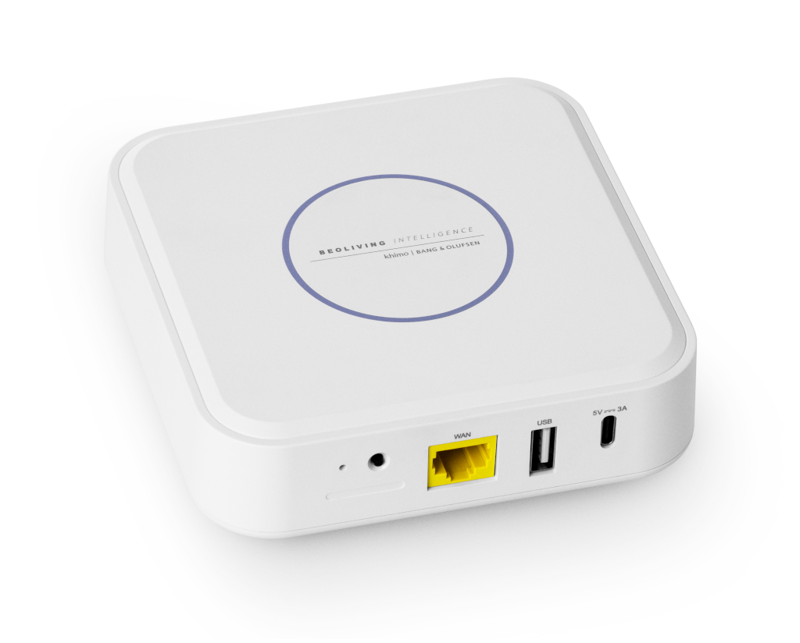

[comment]: <> (For a new horizontal slide use: \n----\n)
[comment]: <> (For a new vertical slide use: \n|||n)
[comment]: <> (To write slide notes uses \nNote:)

## BeoLiving Intelligence
<!-- .slide: data-background-image="./res/shape.jpg" data-background-opacity="0.3" data-background-color="#f1574b" -->

##### by Khimo and Bang & Olufsen

 
<small>Simple integrations that works</small>

---

## What Does Bang & Olufsen Mean in the AV Industry?

<!-- .slide: data-background-image="./res/shape.jpg" data-background-opacity="0.3" data-background-color="#f1574b" -->

---

## What Is Bang & Olufsen in the Home Automation Industry?

<!-- .slide: data-background-image="./res/shape.jpg" data-background-opacity="0.3" data-background-color="#f1574b" -->

---

<!-- .slide: data-background-image="./res/shape.jpg" data-background-opacity="0.3" data-background-color="#f1574b" -->
### B&O is the only AV player that: 

- offers a **fully integrated solution**.

- allows **meaningful integrations** in less than **5 minutes!** of configuration!

---

<!-- .slide: data-background-image="./res/jean.jpg" data-background-opacity="0.2" data-background-color="#f1574b" -->

### BeoLiving Intelligence

###### by Khimo and Bang & Olufsen
<small>integrations that works</small>

---

## REALLY SIMPLE TO SETUP:
<!-- .slide: data-background-image="./res/jean.jpg" data-background-opacity="0.3" data-background-color="#f1574b" -->

1. Define the Zones
1. Connect to the third party system
1. Load the resources in each zone
1. Done

---

## REALLY SIMPLE TO SETUP:

<!-- .slide: data-background-image="./res/jean.jpg" data-background-opacity="0.3" data-background-color="#f1574b" class="container" -->

<iframe width="700" height="515" src="https://www.youtube.com/embed/FXQ7Jgaq1dU?si=FQe_y2xDKxErVLAa" title="YouTube video player" frameborder="0" allow="accelerometer; autoplay; clipboard-write; encrypted-media; gyroscope; picture-in-picture; web-share" referrerpolicy="strict-origin-when-cross-origin" allowfullscreen></iframe>

<small>All the interfaces are populated and ready to go in less than 80 seconds! </small>

---

## EASY TO AUTOMATE: Macros
<!-- .slide: data-background-image="./res/jean.jpg" data-background-opacity="0.3" data-background-color="#f1574b" -->

A macro is a **List of events** that triggers 
  a sorted list of **commands**

---

## EASY TO AUTOMATE: Editor
<!-- .slide: data-background-image="./res/jean.jpg" data-background-opacity="0.3" data-background-color="#f1574b" -->

<video data-autoplay controls width=650 src="./res/macro_lights_beoremote.webm"></video>

---

## EASY TO AUTOMATE: AI
<!-- .slide: data-background-image="./res/jean.jpg" data-background-opacity="0.3" data-background-color="#f1574b" -->

<video data-autoplay controls width=650 src="./res/ai.webm"></video>
<small>The AI assistant could do the macros for you</small>

---

## POWERFULL WHEN YOU NEED IT
<!-- .slide: data-background-image="./res/jean.jpg" data-background-opacity="0.3" data-background-color="#f1574b" -->

<video data-autoplay controls width=650 src="./res/lua_toggle.webm"></video>
<small>If you can imagine it, you can code it</small>

---

## 2 flavours:
<!-- .slide: data-background-image="./res/jean.jpg" data-background-opacity="0.3" data-background-color="#f1574b" -->

 

Essential <small> entry level </small> 

 

PRO <small> for the professional </small>
 <!-- .element: class="fragment" data-fragment-index="2" -->

Note:
  - Essentia:l An entry home controller (From factory) 
  - PRO: BeoLink Gateway  + free remote access + new goodies (must buy an upgrade) 

----
### Essential <small>Entry level</small>
<!-- .slide: data-background-image="./res/alone.jpg" data-background-opacity="0.2" data-background-color="#f1574b" -->

- Plug & Play
- Setup from the **BeoLiving App**
- **Voice** assistants
- Philips Hue
- B&O - **AV and Halo**
- ONVIF cameras
- *Product groups*

Note:
BLI its designed for the end user. Out of the box, could be setted up by some non-technical easy steps.

----

### PRO 
<!-- section.present css
<!-- .slide: class="whiteBack" data-background-image="./res/building.jpg" data-background-opacity="0.2" data-background-color="#f1574b" -->

- Realtime admin panel   <small>Macro programming, AI assistant, Multiuser, Realtime</small>
- Hundred of devices drivers  <small>(Lutron, KNX, Fibaro, Shelly, ...)</small>
- Remote access <small>Use the app from outside of your home</small>

Note:
- Paying for a  one-time PRO license upgrade, BLI will unlock the rest of its  capabilities. The way to pay for this license could be done through BLI  BASIC's web interface. In the future is planned to add a way to upgrade  to PRO through BeoLiving App.
- Besides "global" zone, now there is one more default zone called "unassigned-resources" where all NetworkLink devices are added.

---

<!-- .slide: data-background-image="./res/pattern_soft.jpg" data-background-opacity="0.6" data-background-color="#f1574b" -->
## USE Cases
## Simple Solutions That Make the Difference

---

<!-- .slide: data-background-image="./res/living.jpg" data-background-opacity="0.6" data-background-color="#f1574b" -->
##### USE Cases
### All Off

The simplest integration that makes the case

---

<!-- .slide: data-background-image="./res/haloroom.png" data-background-opacity="0.6" data-background-color="#f1574b" -->
##### USE Cases 
### BeoRemote One and Halo 
### <small>As home automation remote</small>

Control lights, shades, and audio with B&O Remotes

Handle the volume of multiple products

---

<!-- .slide: data-background-image="./res/comercial.jpg" data-background-opacity="0.6" data-background-color="#f1574b" -->
##### USE Cases 
### Product groups

**Persistent link** between multiple speakers

all the speakers working like one

---
###### USE Cases 

<!-- .slide: data-background-image="./res/knx.jpg" data-background-opacity="0.6" data-background-color="#f1574b" -->
### Bring a Legacy Setup to the present

Use the BLI as a technology enabler, allowing the use of all the interfaces of the BLI in old solutions:
- Alexa
- Google Home
- Remote access
- BeoLiving App

E.g.: Make a KNX installation modern!

----

<!-- .slide: data-background-image="./res/living.jpg" data-background-opacity="0.6" data-background-color="#f1574b" -->
###### Use Cases 
### Full Home Solutions Affordable

- **High-end solutions** for the **rooms that matter**
- **IoT solutions** for the others
- Everything **linked together using the BLI**

----

<!-- .slide: data-background-image="./res/living.jpg" data-background-opacity="0.8" data-background-color="#f1574b" -->

## What Is Bang & Olufsen integration for you?

----

<!-- .slide: data-background-image="./res/living.jpg" data-background-opacity="0.9" data-background-color="#f1574b" -->

## NEXT STEP?

----
<!-- .slide: data-background-image="./res/jean.jpg" data-background-opacity="0.3" data-background-color="#f1574b" -->

### Documentation

- Everything at github: khimo.github.io
- Help us improving it!
  - Create a github user
  - Send the user to us
  - Edit it from github
