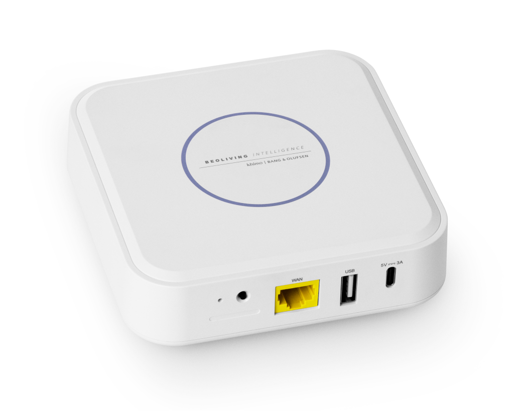
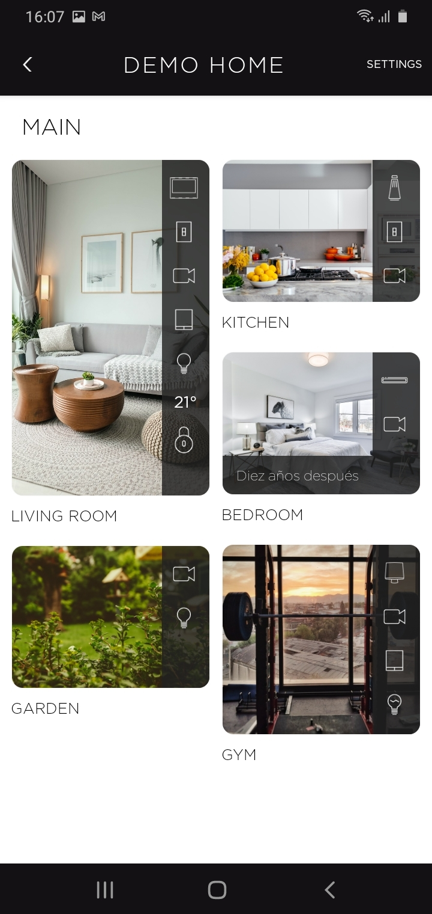
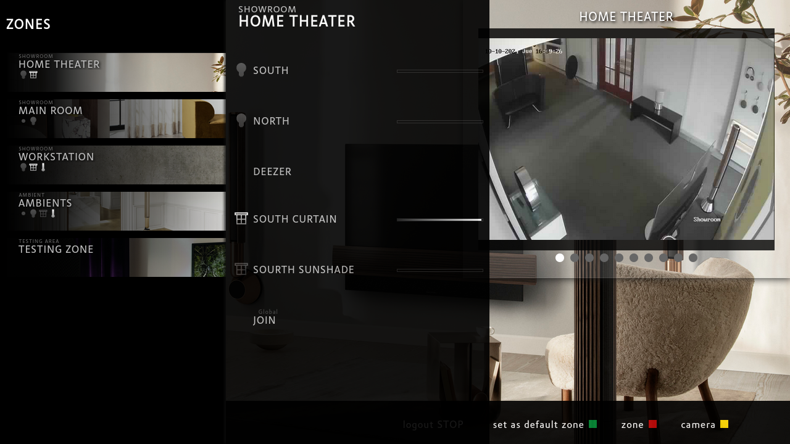
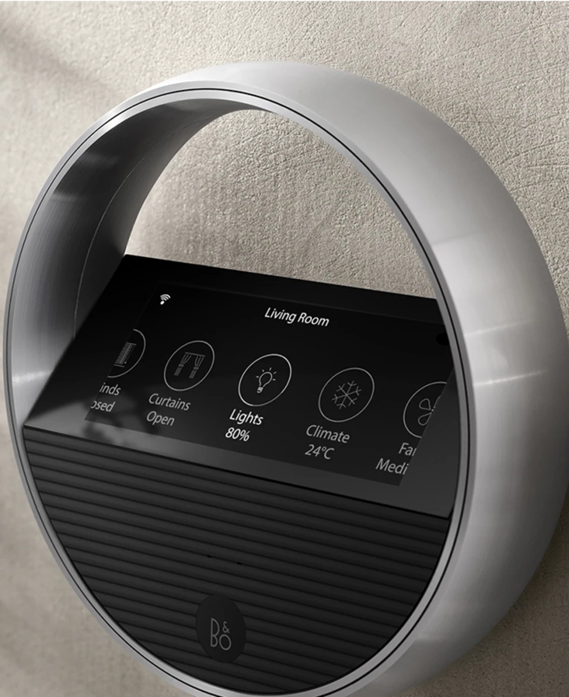
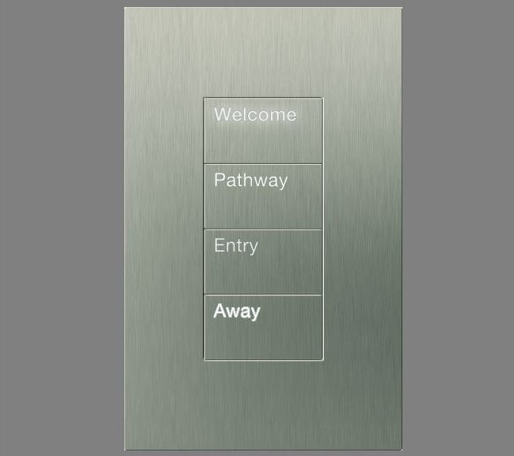
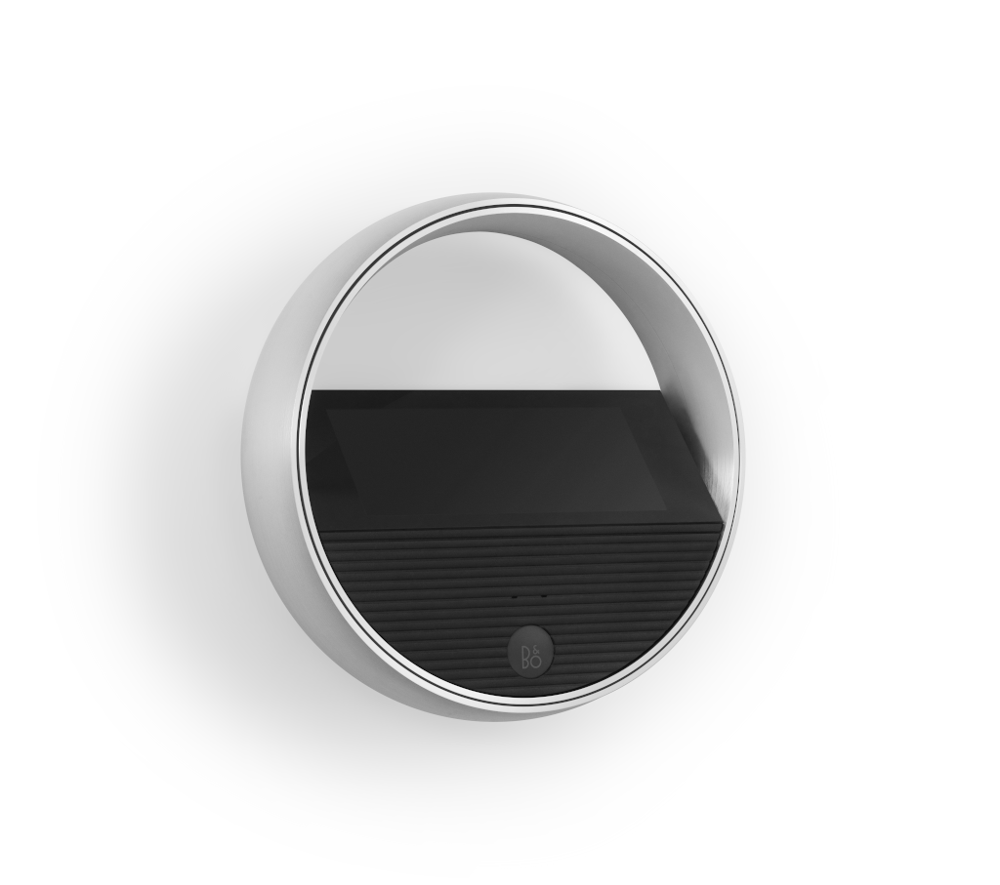
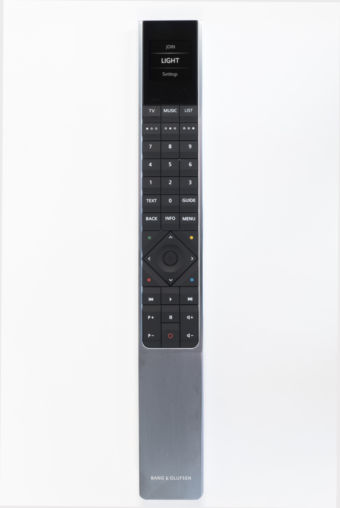

[comment]: <> (For a new horizontal slide use: \n----\n)
[comment]: <> (For a new vertical slide use: \n|||n)
[comment]: <> (To write slide notes uses \nNote:)

## BeoLiving Intelligence
<!-- .slide: data-background-image="./res/shape.jpg" data-background-opacity="0.2" data-background-color="#010000" class="has-light-background" -->

##### by Khimo and Bang & Olufsen

 
<small>Simple integrations that work</small>
 
<small>Madrid, 2024-10</small>

---

<!--
-->
<!-- .slide: data-background-image="./res/shape.jpg" data-background-opacity="0.2" data-background-color="#010000" class="has-light-background" -->
### BeoLiving Intelligence

Meaningful integrations  
in 5 minutes of configuration time

---

## SIMPLE TO SET UP: 
<small>You can fully set this up!</small>

<!-- .slide: data-background-image="./res/living.png" data-background-opacity="0.2" data-background-color="#010000" class="has-light-background" class="container" -->

1. Define the Zones
1. Connect to the third-party system
1. Load the resources in each zone
1. Done

<small>All the interfaces are populated and ready to go in less than 80 seconds! </small>

|||

<iframe width="700" height="515" src="https://www.youtube.com/embed/FXQ7Jgaq1dU?si=FQe_y2xDKxErVLAa" title="YouTube video player" frameborder="0" allow="accelerometer; autoplay; clipboard-write; encrypted-media; gyroscope; picture-in-picture; web-share" referrerpolicy="strict-origin-when-cross-origin" allowfullscreen></iframe>

---
<!-- .slide: data-background-image="./res/jean.jpg" data-background-opacity="0.2" data-background-color="#010000" class="has-light-background" -->

### BeoLiving Intelligence

###### by Khimo and Bang & Olufsen
<small>integrations that work</small> 

---

## EASY TO AUTOMATE: Macros
<!-- .slide: data-background-image="./res/jean.jpg" data-background-opacity="0.2" data-background-color="#010000" class="has-light-background" -->

A macro is a **list of events** that triggers 
  a sorted list of **commands**

---

## EASY TO AUTOMATE: AI
<!-- .slide: data-background-image="./res/jean.jpg" data-background-opacity="0.2" data-background-color="#010000" class="has-light-background" -->

<video data-autoplay autoplay controls width=650 src="./res/ai.webm"></video>
<small>The AI assistant can create the macros for you</small>

---

## 2 Flavors:
<!-- .slide: data-background-image="./res/jean.jpg" data-background-opacity="0.2" data-background-color="#010000" class="has-light-background" -->

 

Essential <small> entry-level </small> 

 

PRO <small> for the professional </small>
 <!-- .xelement: class="fragment" data-fragment-index="2" -->

Note:
  - Essential: An entry home controller (From factory) 
  - PRO: Essential + free remote access + new features (must buy an upgrade) 

----
### Essential <small>Entry level</small>
<!-- .slide: data-background-image="./res/alone.jpg" data-background-opacity="0.2" data-background-color="#010000" class="has-light-background" -->

- Plug & Play
- Setup from the **BeoLiving App**
- **Voice** assistants
- Philips Hue
- B&O - **AV and Halo**
- ONVIF cameras
- *Product groups*

Note:
BLI is designed for the end user. Out of the box, it can be set up with some non-technical easy steps.

----

### PRO 
<!-- section.present css
<!-- .slide: class="whiteBack" data-background-image="./res/building.jpg" data-background-opacity="0.2" data-background-color="#010000" class="has-light-background" -->

- Realtime admin panel   <small>Macro programming, AI assistant, Multiuser, Realtime</small>
- Hundreds of device drivers  <small>(Lutron, KNX, Fibaro, Shelly, ...)</small>
- Remote access <small>Use the app from outside your home</small>
- Remote programming <b>[ NEW ]</b>  <small>Use tunnels to program the BLI remotely</small>

---

<!-- .slide: data-background-image="./res/living3.png" data-background-opacity="0.2" data-background-color="#010000" -->

## Why? 
 
 

##  <!-- .element: class="fragment current-visible" --> BECAUSE WE MUST **ADD VALUE AND STAND OUT**

Note:
  - Because the market is competitive
  - Plenty of offering and pricing
  - We must add more value to our offering

---

<!-- .slide: data-background-image="./res/living3.png" data-background-opacity="0.2" data-background-color="#010000" -->

## How?

 

  <!-- .element: class="fragment current-visible" --> 
<h2>By selling expierences </h2><small> not products </small>

 
 

<i>“The most profound technologies are those that disappear.”</i> <small>Mark weiser</small>

Note:
  - If we make technology simpler, we can offer more value.
  - Because we can offer more value.
  - The BeoLiving Intelligence is your experience enabler.

---

<!-- .slide: data-background-image="./res/living3.png" data-background-opacity="0.2" data-background-color="#010000" -->

## Why experiences?

  <!-- .element: class="fragment current-visible" --> 
   
  

  Less friction for the user
  

   
  

  We build relationships with our customers, 
 relationships that grows
  

   

Note:
  - If it is easy to use, he can control more technology and then you can sell more technology.
  - We offer more value
  - We create a relationship with the user, which allows for continuous contact and new opportunities will arise from this.

---

<!-- .slide: data-background-image="./res/pointing.jpeg" data-background-opacity="0.2" data-background-color="#010000" class="has-light-background" -->
## USE Cases
## Simple Solutions That Make the Difference

---

<!-- .slide: data-background-image="./res/pointing.jpeg" data-background-opacity="0.2" data-background-color="#aaa" class="has-light-background" -->
#### Use Cases: ONE BUTTON

<b>WELCOME</b>  
<b>PARTY</b>  
<b>AWAY</b>  

<small>The simplest integration that makes the case</small>

---

<!-- .slide: data-background-image="./res/living2.png" data-background-opacity="0.2" data-background-color="#aaa" -->
#### Use Cases: Simple store automation

<b>OPEN</b>  
<b>DEMO MODE</b>  
<b>MULTIROOM</b>  
<b>CLOSE</b>  

<small>Do a demonstration without touching an app!</small>

---

<!-- .slide: data-background-image="./res/framebl8.png" data-background-opacity="0.2" data-background-color="#010000" class="has-light-background" -->

#### Use Cases: Cinema experience

 

BeoSound Theatre

Projector

Screen

Lift

Lights

Shades

----

<!-- .slide: data-background-image="./res/haloroom.png" data-background-opacity="0.2" data-background-color="#010000" class="has-light-background" -->
#### Use Cases: BeoRemote One and Halo 
### <small>As home automation remote</small>

Control lights, shades, and audio with B&O Remotes

Handle the volume of multiple products

---

<!-- .slide: data-background-image="./res/comercial.jpg" data-background-opacity="0.2" data-background-color="#010000" class="has-light-background" -->
#### Use Cases: Persistent Product groups

**Persistent link** between multiple speakers

all the speakers working like one

**local operation from master and remotes**

---

<!-- .slide: data-background-image="./res/door.jpeg" data-background-opacity="0.2" data-background-color="#010000" class="has-light-background" -->
#### Use Cases: Announcements / Notifications

 

Your Mozart product can alert you when someone is at the door  

 

or send a TV notification to open the door with your remote.

---
###### Advanced USE Cases 

<!-- .slide: data-background-image="./res/knx.jpg" data-background-opacity="0.2" data-background-color="#010000" class="has-light-background" -->
### Legacy to the present

Use the BLI as a technology enabler:

 

Alexa / Google Home / AI 

Remote access / BeoLiving App / Halo

----

<!-- .slide: data-background-image="./res/living.jpg" data-background-opacity="0.3" data-background-color="#010000" class="has-light-background" -->
###### Advanced Use Cases 
### Full Home Solutions Affordable

 

**High-end solutions** for the **rooms that matter**

**IoT solutions** for the others

Everything **integrated using the BLI**

---

<!-- .slide: data-background-image="./res/living4.png" data-background-opacity="0.2" data-background-color="#010000" class="has-light-background" -->
#### Advanced Use Cases: Boston Experience Center

<video id="videoBoston" controls style="width: 100%; max-width: 1024px; max-height: 75vw;">
  <source src="./res/boston_experience_center_short.webm" type="video/webm">
</video>

---

<!-- .slide: data-background-image="./res/living4.png" data-background-opacity="0.2" data-background-color="#010000" class="has-light-background" -->
#### Advanced Use Cases: Boston Experience Center

https://youtu.be/tw-Rtd1mpjk?si=tOHtOhisV6ZBgIFQ

---

<!-- .slide: data-background-video="./res/boston_experience_center_short.webm"   data-background-color="#aaa"  data-background-video-loop data-background-video-muted -->
### Store Guidelines to Success

 

**Keep it simple**   
<small>with demos that always work.</small>

 

**One person is responsible**   <small> To update products.</small>

----

<!-- .slide: data-background-image="./res/asia.jpg" data-background-opacity="0.3" data-background-color="#010000" class="has-light-background" -->
#### Advanced Use Cases: 
#### Condominiums: Mirigi: smart concierge.

 

A smart concierge SAS that integrates with BeoLiving Intelligence and B&O.

 

**Approach a full building!**

 
<small>E.g.: Request your car from a button in your Halo.</small>

----

<!-- .slide: data-background-image="./res/Jade_buildings_Sunny_Isles.jpg" data-background-opacity="0.3" data-background-color="#010000" class="has-light-background" -->
#### Mirigi: smart concierge: modules:

- Notifications / AI
- Work Orders
- Valet Parking
- Restaurants / Shops
- Expenses
- Polls
- BeoLiving Intelligence
- Reservations
- More...

----

<!-- .slide: data-background-image="./res/joy.jpg" data-background-opacity="0.3" data-background-color="#010000" class="has-light-background" -->
#### Mirigi: smart concierge: Fully customizable:

<small>Each building deserves its APP.</small>

----

<!-- .slide: data-background-image="./res/asia.jpg" data-background-opacity="0.3" data-background-color="#010000" class="has-light-background" -->

#### Mirigi: smart concierge.

 

Sell products throughout the entire building!

 

<b>More info: <a href="https://mirigi.com/"> mirigi.com </a> </b>

----
<!-- .slide: data-background-image="./res/living3.png" data-background-opacity="0.2" data-background-color="#010000" class="has-light-background" -->

### Documentation

  

<b><a href="https://khimo.github.io">khimo.github.io</a></b>

<b><a href="https://mirigi.com/"> mirigi.com </a> </b>

---

<!-- .slide: data-background-image="./res/living4.png" data-background-opacity="0.2" data-background-color="#010000" class="has-light-background" -->

# Thanks!

