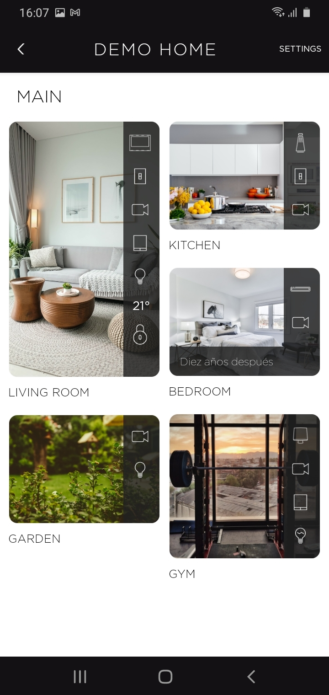
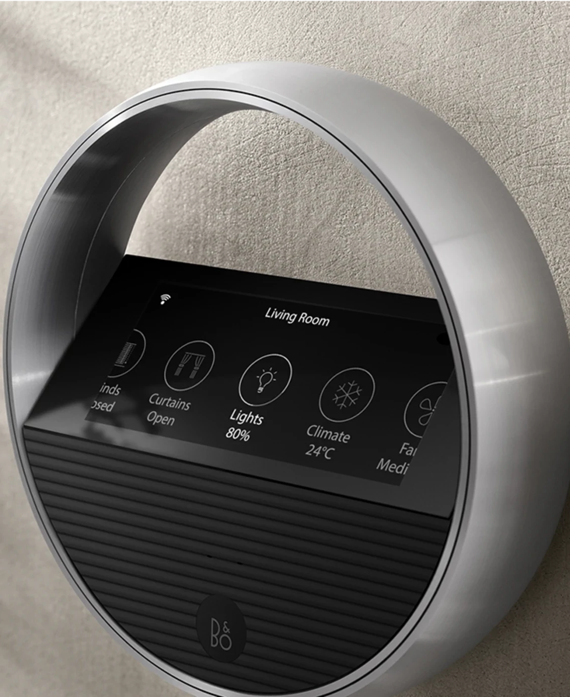
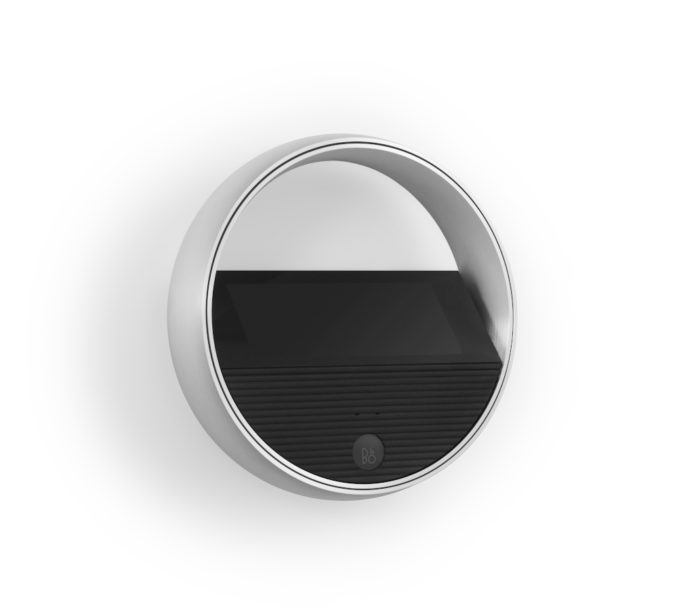

[comment]: <> (For a new horizontal slide use: \n----\n)
[comment]: <> (For a new vertical slide use: \n|||n)
[comment]: <> (To write slide notes uses \nNote:)

## BeoLiving Intelligence
<!-- .slide: data-background-image="./res/shape.jpg" data-background-opacity="0.2" data-background-color="#010000" class="has-light-background" -->

##### por Khimo e Bang & Olufsen

 
<small>Integrações simples que funcionam</small>
 
<small>Madrid, 2024-10</small>

---

<!--
-->
<!-- .slide: data-background-image="./res/shape.jpg" data-background-opacity="0.2" data-background-color="#010000" class="has-light-background" -->
### BeoLiving Intelligence

Integrações significativas  
em 5 minutos de tempo de configuração

---

## SIMPLES DE CONFIGURAR: 
<small>Você pode configurar tudo isto!</small>

<!-- .slide: data-background-image="./res/living.png" data-background-opacity="0.2" data-background-color="#010000" class="has-light-background" class="container" -->

1. Defina as Zonas
1. Conecte ao sistema de terceiros
1. Carregue os recursos em cada zona
1. Feito

<small>Todas as interfaces são preenchidas e prontas para uso em menos de 80 segundos! </small>

|||
<iframe width="700" height="515" src="https://www.youtube.com/embed/FXQ7Jgaq1dU?si=FQe_y2xDKxErVLAa" title="YouTube video player" frameborder="0" allow="accelerometer; autoplay; clipboard-write; encrypted-media; gyroscope; picture-in-picture; web-share" referrerpolicy="strict-origin-when-cross-origin" allowfullscreen></iframe>

---
<!-- .slide: data-background-image="./res/jean.jpg" data-background-opacity="0.2" data-background-color="#010000" class="has-light-background" -->

### BeoLiving Intelligence

###### por Khimo e Bang & Olufsen
<small>integrações que funcionam</small> 

---

## FÁCIL DE AUTOMATIZAR: Macros
<!-- .slide: data-background-image="./res/jean.jpg" data-background-opacity="0.2" data-background-color="#010000" class="has-light-background" -->

Uma macro é uma **Lista de eventos** que desencadeia 
  uma lista ordenada de **comandos**

---

## FÁCIL DE AUTOMATIZAR: IA
<!-- .slide: data-background-image="./res/jean.jpg" data-background-opacity="0.2" data-background-color="#010000" class="has-light-background" -->

<video data-autoplay controls width=650 src="./res/ai.webm"></video>
<small>O assistente de IA pode fazer as macros por você</small>

---

## 2 sabores:
<!-- .slide: data-background-image="./res/jean.jpg" data-background-opacity="0.2" data-background-color="#010000" class="has-light-background" -->

 

Essential <small> nível de entrada </small> 

 

PRO <small> para o profissional </small>
 <!-- .element: class="fragment" data-fragment-index="2" -->

Note:
  - Essentia:l Um controlador de casa de entrada (De fábrica) 
  - PRO: Essential  + acesso remoto gratuito + novas funcionalidades (é necessário comprar uma atualização) 

----
### Essential <small>Nível de entrada</small>
<!-- .slide: data-background-image="./res/alone.jpg" data-background-opacity="0.2" data-background-color="#010000" class="has-light-background" -->

- Plug & Play
- Configuração a partir da **BeoLiving App**
- Assistentes de **Voz**
- Philips Hue
- B&O - **AV e Halo**
- Câmaras ONVIF
- *Grupos de produtos*

Note:
BLI é projetado para o usuário final. Pronto para uso, pode ser configurado por alguns passos fáceis e não técnicos.

----

### PRO 
<!-- section.present css
<!-- .slide: class="whiteBack" data-background-image="./res/building.jpg" data-background-opacity="0.2" data-background-color="#010000" class="has-light-background" -->

- Painel de administração em tempo real   <small>Programação de macros, assistente de IA, Multiusuário, Tempo real</small>
- Centenas de drivers de dispositivos  <small>(Lutron, KNX, Fibaro, Shelly, ...)</small>
- Acesso remoto <small>Use a app fora de casa</small>
- Programação remota <b>[ NOVO ]</b>  <small>Use túneis para programar o BLI remotamente</small>

---
<!-- .slide: data-background-image="./res/living3.png" data-background-opacity="0.2" data-background-color="#010000" -->
## Porquê?

Estamos a **vender experiências**, não apenas produtos.

 

Devemos **destacar-nos**.

 

Criamos **relações** com os nossos clientes, relações que crescem.

---

<!-- .slide: data-background-image="./res/pattern_soft.jpg" data-background-opacity="0.2" data-background-color="#010000" class="has-light-background" -->
## CASOS DE USO
## Soluções Simples Que Fazem a Diferença

---

<!-- .slide: data-background-image="./res/framebl8.png" data-background-opacity="0.2" data-background-color="#010000" class="has-light-background" -->

###### Casos de Uso 
### Experiência de Cinema

 

BeoSound Theatre

Projetor

Tela

Elevador

Luzes

Persianas

----

<!-- .slide: data-background-image="./res/haloroom.png" data-background-opacity="0.2" data-background-color="#010000" class="has-light-background" -->
##### Casos de Uso 
### BeoRemote One e Halo 
### <small>Como controle remoto de automação residencial</small>

Controle luzes, persianas e áudio com os Controles Remotos B&O

Controle o volume de vários produtos

---

<!-- .slide: data-background-image="./res/comercial.jpg" data-background-opacity="0.2" data-background-color="#010000" class="has-light-background" -->
##### Casos de Uso 
### Grupos de Produtos

**Ligação persistente** entre vários altifalantes

todos os altifalantes funcionando como um só

---
###### Casos de Uso Avançados 

<!-- .slide: data-background-image="./res/knx.jpg" data-background-opacity="0.2" data-background-color="#010000" class="has-light-background" -->
### Do Legado ao Presente

Use o BLI como um habilitador de tecnologia:

Alexa / Google Home / IA

Acesso remoto

BeoLiving App

Halo

Ex.: Torne uma instalação KNX moderna!

----

<!-- .slide: data-background-image="./res/living.jpg" data-background-opacity="0.3" data-background-color="#010000" class="has-light-background" -->
###### Casos de Uso Avançados 
### Soluções Completas para Casa Acessíveis

 

**Soluções de alta qualidade** para as **salas que importam**

**Soluções IoT** para as outras

Tudo **integrado usando o BLI**

----

<!-- .slide: data-background-image="./res/asia.jpg" data-background-opacity="0.3" data-background-color="#010000" class="has-light-background" -->
###### Casos de Uso Avançados 
### Condomínios: Mirigi: concierge inteligente.

 

O BeoLiving Intelligence integra-se com o Mirigi.

**Aborde um edifício inteiro!**

<small>Ex.: Solicite o seu carro a partir de um botão no seu Halo.</small>

<b>Mais informações: <a href="https://mirigi.com/"> mirigi.com </a> </b>

---

<!-- .slide: data-background-image="./res/living.jpg" data-background-opacity="0.2" data-background-color="#010000" class="has-light-background" -->
##### Casos de Uso
### Automação de Lojas

<b>ABRIR</b>  
<b>DEMO</b>  
<b>FECHAR</b>  

<small>A integração mais simples que faz a diferença</small>

---

<!-- .slide: data-background-image="./res/living.png" data-background-opacity="0.2" data-background-color="#010000" class="has-light-background" -->
### Diretrizes para o Sucesso na Loja

 

**Mantenha-o simples**   
<small>com demonstrações que sempre funcionam.</small>

 

**Uma pessoa é responsável**   <small> por mudar os números de série na página de Recursos para manter tudo a funcionar.</small>

----
<!-- .slide: data-background-image="./res/living3.png" data-background-opacity="0.2" data-background-color="#010000" class="has-light-background" -->

### Documentação

  

<b><a href="https://khimo.github.io">khimo.github.io</a></b>

<b><a href="https://mirigi.com/"> mirigi.com </a> </b>

