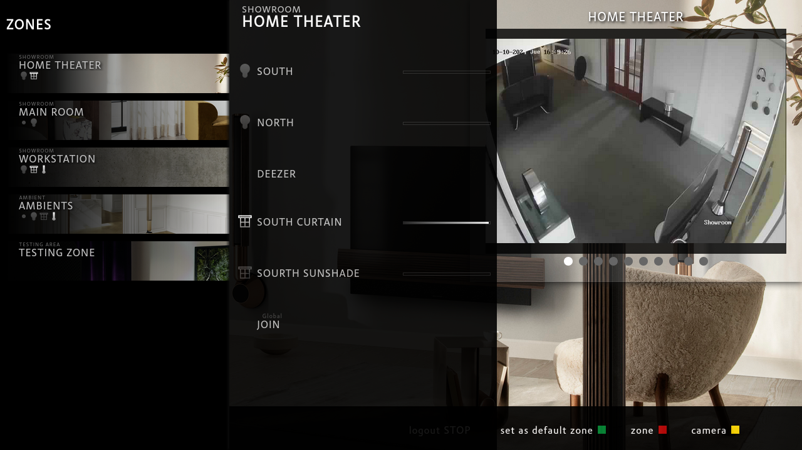

[comment]: <> (For a new horizontal slide use: \n----\n)
[comment]: <> (For a new vertical slide use: \n|||n)
[comment]: <> (To write slide notes uses \nNote:)

## BeoLiving Intelligence
<!-- .slide: data-background-image="./res/shape.jpg" data-background-opacity="0.2" data-background-color="#010000" class="has-light-background" -->

##### por Khimo e Bang & Olufsen

 
<small>Integrações simples que funcionam</small>
 
<small>Madrid, 2024-10</small>

---

<!--
-->
<!-- .slide: data-background-image="./res/shape.jpg" data-background-opacity="0.2" data-background-color="#010000" class="has-light-background" -->
### BeoLiving Intelligence

Integrações significativas  
em 5 minutos de tempo de configuração

---

## SIMPLES DE CONFIGURAR: 
<small>Podes configurar tudo isto!</small>

<!-- .slide: data-background-image="./res/living.png" data-background-opacity="0.2" data-background-color="#010000" class="has-light-background" class="container" -->

1. Define as Zonas
1. Conecta ao sistema de terceiros
1. Carrega os recursos em cada zona
1. Feito

<small>Todas as interfaces estão preenchidas e prontas a usar em menos de 80 segundos! </small>

|||

<iframe width="700" height="515" src="https://www.youtube.com/embed/FXQ7Jgaq1dU?si=FQe_y2xDKxErVLAa" title="YouTube video player" frameborder="0" allow="accelerometer; autoplay; clipboard-write; encrypted-media; gyroscope; picture-in-picture; web-share" referrerpolicy="strict-origin-when-cross-origin" allowfullscreen></iframe>

---
<!-- .slide: data-background-image="./res/jean.jpg" data-background-opacity="0.2" data-background-color="#010000" class="has-light-background" -->

### BeoLiving Intelligence

###### por Khimo e Bang & Olufsen
<small>integrações que funcionam</small> 

---

## FÁCIL DE AUTOMATIZAR: Macros
<!-- .slide: data-background-image="./res/jean.jpg" data-background-opacity="0.2" data-background-color="#010000" class="has-light-background" -->

Uma macro é uma **lista de eventos** que desencadeia 
  uma lista ordenada de **comandos**

---

## FÁCIL DE AUTOMATIZAR: IA
<!-- .slide: data-background-image="./res/jean.jpg" data-background-opacity="0.2" data-background-color="#010000" class="has-light-background" -->

<video data-autoplay autoplay controls width=650 src="./res/ai.webm"></video>
<small>O assistente de IA pode criar as macros para ti</small>

---

## 2 Sabores:
<!-- .slide: data-background-image="./res/jean.jpg" data-background-opacity="0.2" data-background-color="#010000" class="has-light-background" -->

 

Essential <small> nível de entrada </small> 

 

PRO <small> para o profissional </small>
 <!-- .xelement: class="fragment" data-fragment-index="2" -->

Note:
  - Essential: Um controlador de casa de entrada (De fábrica) 
  - PRO: Essential + acesso remoto gratuito + novas funcionalidades (é necessário comprar uma atualização) 

----
### Essential <small>Nível de entrada</small>
<!-- .slide: data-background-image="./res/alone.jpg" data-background-opacity="0.2" data-background-color="#010000" class="has-light-background" -->

- Plug & Play
- Configuração a partir da **BeoLiving App**
- Assistentes de **Voz**
- Philips Hue
- B&O - **AV e Halo**
- Câmaras ONVIF
- *Grupos de produtos*

Note:
BLI é projetado para o utilizador final. Pronto a usar, pode ser configurado com alguns passos fáceis e não técnicos.

----

### PRO 
<!-- section.present css
<!-- .slide: class="whiteBack" data-background-image="./res/building.jpg" data-background-opacity="0.2" data-background-color="#010000" class="has-light-background" -->

- Painel de administração em tempo real   <small>Programação de macros, assistente de IA, Multiutilizador, Tempo real</small>
- Centenas de drivers de dispositivos  <small>(Lutron, KNX, Fibaro, Shelly, ...)</small>
- Acesso remoto <small>Usa a app fora de casa</small>
- Programação remota <b>[ NOVO ]</b>  <small>Usa túneis para programar o BLI remotamente</small>

---

<!-- .slide: data-background-image="./res/living3.png" data-background-opacity="0.2" data-background-color="#010000" -->
## Porquê?

Devemos **destacar-nos**

 

Estamos a **vender experiências**
 <small> não apenas produtos</small>

 

Criamos **relações** com os nossos clientes <small>relações que crescem</small>

---

<!-- .slide: data-background-image="./res/pointing.jpeg" data-background-opacity="0.2" data-background-color="#010000" class="has-light-background" -->
## CASOS DE USO
## Soluções Simples Que Fazem a Diferença

---

<!-- .slide: data-background-image="./res/pointing.jpeg" data-background-opacity="0.2" data-background-color="#aaa" class="has-light-background" -->
#### Casos de Uso: UM BOTÃO

<b>BEM-VINDO</b>  
<b>FORA</b>  

<small>A integração mais simples que faz a diferença</small>

---

<!-- .slide: data-background-image="./res/living2.png" data-background-opacity="0.2" data-background-color="#aaa" -->
#### Casos de Uso: Automação simples de loja

<b>ABRIR</b>  
<b>MODO DEMO</b>  
<b>FECHAR</b>  

<small>Faz uma demonstração sem tocar numa app!</small>

---

<!-- .slide: data-background-image="./res/framebl8.png" data-background-opacity="0.2" data-background-color="#010000" class="has-light-background" -->

#### Casos de Uso: Experiência de cinema

 

BeoSound Theatre

Projetor

Tela

Elevador

Luzes

Cortinas

----

<!-- .slide: data-background-image="./res/haloroom.png" data-background-opacity="0.2" data-background-color="#010000" class="has-light-background" -->
#### Casos de Uso: BeoRemote One e Halo 
### <small>Como controlo remoto de automação residencial</small>

Controla luzes, cortinas e áudio com os Controles Remotos B&O

Controla o volume de múltiplos produtos

---

<!-- .slide: data-background-image="./res/comercial.jpg" data-background-opacity="0.2" data-background-color="#010000" class="has-light-background" -->
#### Casos de Uso: Grupos de Produtos Persistentes

**Ligação persistente** entre múltiplos altifalantes

todos os altifalantes a funcionar como um só

**operação local a partir do mestre e dos remotos**

---

<!-- .slide: data-background-image="./res/door.jpeg" data-background-opacity="0.2" data-background-color="#010000" class="has-light-background" -->
#### Casos de Uso: Anúncios / Notificações

 

O teu produto Mozart pode alertar-te quando alguém está à porta  

 

ou enviar uma notificação na TV para abrir a porta com o teu controlo remoto.

---
###### Casos de Uso Avançados 

<!-- .slide: data-background-image="./res/knx.jpg" data-background-opacity="0.2" data-background-color="#010000" class="has-light-background" -->
### Do legado ao presente

Usa o BLI como um facilitador de tecnologia:

 

Alexa / Google Home / IA 

Acesso remoto / BeoLiving App / Halo

----

<!-- .slide: data-background-image="./res/living.jpg" data-background-opacity="0.3" data-background-color="#010000" class="has-light-background" -->
###### Casos de Uso Avançados 
### Soluções Completas para Casa Acessíveis

 

**Soluções de alta gama** para as **salas que importam**

**Soluções IoT** para as outras

Tudo **integrado usando o BLI**

---

<!-- .slide: data-background-image="./res/living4.png" data-background-opacity="0.2" data-background-color="#010000" class="has-light-background" -->
#### Casos de Uso Avançados: Centro de Experiência de Boston

<video id="videoBoston" controls style="width: 100%; max-width: 1024px; max-height: 75vw;">
  <source src="./res/boston_experience_center_short.webm" type="video/webm">
</video>

---

<!-- .slide: data-background-image="./res/living4.jpg" data-background-opacity="0.2" data-background-color="#010000" class="has-light-background" -->
#### Casos de Uso Avançados: Centro de Experiência de Boston

https://youtu.be/tw-Rtd1mpjk?si=tOHtOhisV6ZBgIFQ

---

<!-- .slide: data-background-video="./res/boston_experience_center_short.webm"   data-background-color="#aaa"  data-background-video-loop data-background-video-muted -->
### Diretrizes de Sucesso para Lojas

 

**Mantém simples**   
<small>com demos que funcionam sempre.</small>

 

**Uma pessoa é responsável**   <small> Para atualizar produtos.</small>

----

<!-- .slide: data-background-image="./res/asia.jpg" data-background-opacity="0.3" data-background-color="#010000" class="has-light-background" -->
#### Casos de Uso Avançados: 
#### Condomínios: Mirigi: concierge inteligente.

 

Um concierge inteligente SAS que integra com BeoLiving Intelligence e B&O.

 

**Aborda um edifício inteiro!**

 
<small>Ex.: Solicita o teu carro a partir de um botão no teu Halo.</small>

----

<!-- .slide: data-background-image="./res/Jade_buildings_Sunny_Isles.jpg" data-background-opacity="0.3" data-background-color="#010000" class="has-light-background" -->
#### Mirigi: concierge inteligente: módulos:

- Notificações / IA
- Ordens de Trabalho
- Estacionamento com Valet
- Restaurantes / Lojas
- Despesas
- Sondagens
- BeoLiving Intelligence
- Reservas
- Mais...

----

<!-- .slide: data-background-image="./res/joy.jpg" data-background-opacity="0.3" data-background-color="#010000" class="has-light-background" -->
#### Mirigi: concierge inteligente: Totalmente personalizável:

<small>Cada edifício merece a sua APP.</small>

----

<!-- .slide: data-background-image="./res/asia.jpg" data-background-opacity="0.3" data-background-color="#010000" class="has-light-background" -->

#### Mirigi: concierge inteligente.

 

Vende produtos em todo o edifício!

 

<b>Mais informações: <a href="https://mirigi.com/"> mirigi.com </a> </b>

----
<!-- .slide: data-background-image="./res/living3.png" data-background-opacity="0.2" data-background-color="#010000" class="has-light-background" -->

### Documentação

  

<b><a href="https://khimo.github.io">khimo.github.io</a></b>

<b><a href="https://mirigi.com/"> mirigi.com </a> </b>

---

# Obrigado!

