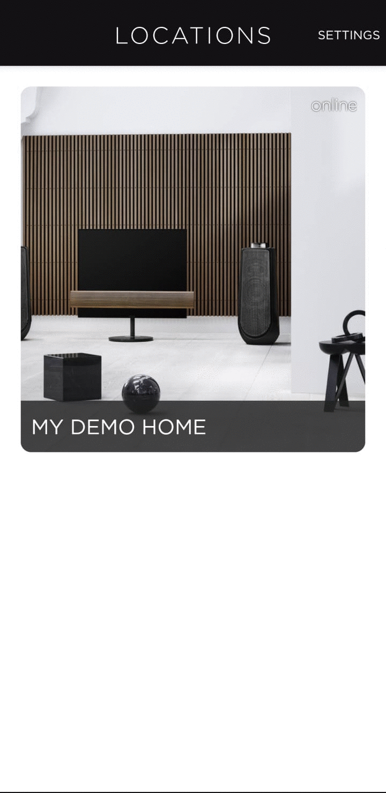

[comment]: <> (For a new horizontal slide use: \n----\n)
[comment]: <> (For a new vertical slide use: \n|||n)
[comment]: <> (To write slide notes use \nNote:)


## BeoLiving Intelligence
<!-- .slide: data-background-image="./res/shape.jpg" data-background-opacity="0.2" data-background-color="#010000" class="has-light-background" -->

##### por Khimo y Bang & Olufsen


<br/>
<small>Entrenamiento técnico</small>
<br/>
<small>Madrid, 2024-10</small>

----

<!-- .slide: data-background-image="./res/living4.png" data-background-opacity="0.2" data-background-color="#010000" class="has-light-background" -->
## Configuración
| BLI  |  Philips HUE IP  | Halo SN | 
|---|---|---|
|  Unidad 25  |  1  | |
|  Unidad 82  |  1  | |
|  Unidad 83  |  2  | |
|  Unidad 58  |  2  | |

----
<!-- .slide: data-background-image="./res/living3.png" data-background-opacity="0.2" data-background-color="#010000" class="has-light-background" -->
## Entrenamiento Técnico: Ejercicio 1

<p> Construir una configuración rápida con todos los recursos del hogar, obteniendo la interfaz de usuario automáticamente </p>

---

<iframe width="700" height="515" src="https://www.youtube.com/embed/FXQ7Jgaq1dU?si=FQe_y2xDKxErVLAa" title="YouTube video player" frameborder="0" allow="accelerometer; autoplay; clipboard-write; encrypted-media; gyroscope; picture-in-picture; web-share" referrerpolicy="strict-origin-when-cross-origin" allowfullscreen></iframe>

----
<!-- .slide: data-background-image="./res/living3.png" data-background-opacity="0.2" data-background-color="#010000" class="has-light-background" -->
### Desempaquetado | Primeros Pasos

1. Conectar a la red
1. Encontrar en la red
2. Obtener acceso (Restablecimiento de contraseña)
3. Actualización de firmware


---

### 1 | Encontrar en la Red
<!-- .slide: data-background-image="./res/living3.png" data-background-opacity="0.2" data-background-color="#010000" class="has-light-background" -->

- Usando la App BeoLiving

- En una red con un solo BLI, desde iOS, Android, MacOS, Linux: http://bli.local

Una vez que tenemos el host, desde cualquier navegador web (preferiblemente CHROME) ingresamos: https://HOST/

---

<!-- .slide: data-background-image="./res/living3.png" data-background-opacity="0.2" data-background-color="#010000" class="has-light-background" -->

#### 1 | Encontrar en la Red: Usando la App BeoLiving:


---

<!-- .slide: data-background-image="./res/living3.png" data-background-opacity="0.2" data-background-color="#010000" class="has-light-background" -->
#### Botón de Usuario

Funciones:
- **1**: Disparar un evento de BeoLiving Intelligence
- **2**: Establecer la **contraseña** de _admin_ a _"admin"_ (por 5 minutos)
- **3**: **IP Fija** (192.168.1.10).
- **4**: **DHCP**.
- **5**: <b style="color:orange">Borrar</b> toda la configuración y ajustes.

---

<!-- .slide: data-background-image="./res/living2.png" data-background-opacity="0.2" data-background-color="#010000" class="has-light-background" -->

### 2 | Restablecimiento de Contraseña / Inicio de Sesión

- Usar la función 2 del BOTÓN DE USUARIO para RESTABLECER la contraseña de admin 

|||

<!-- .slide: data-background-image="./res/living2.png" data-background-opacity="0.2" data-background-color="#010000" class="has-light-background" -->

<iframe width="560" height="315" src="https://www.youtube.com/embed/Xxjk1Tv4PM4?si=Y7gq-jEYym9Ae7HF" title="YouTube video player" frameborder="0" allow="accelerometer; autoplay; clipboard-write; encrypted-media; gyroscope; picture-in-picture; web-share" referrerpolicy="strict-origin-when-cross-origin" allowfullscreen></iframe>

|||
<!-- .slide: data-background-image="./res/living2.png" data-background-opacity="0.2" data-background-color="#010000" class="has-light-background" -->

Presione y mantenga presionado el botón hasta que el LED parpadee dos veces en rojo, suelte el botón, el LED parpadeará rápidamente, toque el botón para confirmar.

Ahora ingrese al navegador y use usuario **admin** y contraseña **admin**, esta contraseña será válida por 5 minutos después del procedimiento del botón de usuario.

Ahora defina la contraseña como **khimo**.

-----

<!-- .slide: data-background-image="./res/living2.png" data-background-opacity="0.2" data-background-color="#010000" class="has-light-background" -->
### 3 | Estructura del Hogar, Áreas y Zonas

- Ir a "Admin -> Zones".
- Presionar "Add Area" y luego el "+" para agregar la zona.
- Use el nombre de su equipo para el área, y elija un nombre y una imagen.

Cada equipo tendrá su propia área y zona con el nombre de su equipo, pueden elegir una foto que los represente para la habitación.

---

<!-- .slide: data-background-image="./res/living.jpg" data-background-opacity="0.2" data-background-color="#010000" class="has-light-background" -->

### 4.1 Agregar Sistemas:

- Ir a "Admin -> Systems"
- Presionar el símbolo "[+]" en su zona 
- Agregar el controlador "Philips Hue CLIP"

Dirección de Philips hue: FIXME


---

<!-- .slide: data-background-image="./res/living4.png" data-background-opacity="0.2" data-background-color="#010000" class="has-light-background" -->
#### 4.2 | Sistema: Enlace a BeoCloud: PIN de Integración

FIXME: Crear un PIN de integración por grupo


---

<!-- .slide: data-background-image="./res/living2.png" data-background-opacity="0.2" data-background-color="#010000" class="has-light-background" -->


#### 5.1. Recursos:  Mozart (B&O Control Link]

- "Admin -> Resources"
- "Control Link"
- [Mostrar recursos descubiertos]
- Agregar su producto a su zona

   **NOTA:** Los productos pueden ser asignados por SN o por IP.

---

<!-- .slide: data-background-image="./res/living3.png" data-background-opacity="0.2" data-background-color="#010000" class="has-light-background" -->
#### 5.2 Philips HUE: Recursos

- "Resources" -> la zona del equipo -> Philips HUE
- [Cargar recursos de sistemas conectados]
- Importar los recursos a su zona

 Todos deben importar las luces en su zona.

---

<!-- .slide: data-background-image="./res/living2.png" data-background-opacity="0.2" data-background-color="#010000" class="has-light-background" -->
#### 5.3. Halo

   Este paso solo debe ser realizado por el primer equipo del BLI. Usando la misma idea que en el paso 5.1 el equipo debe definir el Halo en su habitación.

---

<!-- .slide: data-background-image="./res/living.jpg" data-background-opacity="0.2" data-background-color="#010000" class="has-light-background" -->
### 6. Exploramos las interfaces y exploramos lo que hemos aprendido:
- App BeoLiving
- Halo
- TV

---

<!-- .slide: data-background-image="./res/living1.png" data-background-opacity="0.2" data-background-color="#010000" class="has-light-background" -->
### 7. Ciclo de Vida de la Configuración

- EDICIÓN EN VIVO
- Potente historial de configuración
- Herramientas -> Configuración

---

<!-- .slide: data-background-image="./res/living2.png" data-background-opacity="0.2" data-background-color="#010000" class="has-light-background" -->
### 8. Mantenimiento de Almacenamiento:

- IP Fija DHCP 

o

- Mantenimiento SN

----

<!-- .slide: data-background-video="./res/boston_experience_center_short.webm"   data-background-color="#aaa"  data-background-video-loop data-background-video-muted -->

### ¿Tomamos un descanso, tiempo para relajarse?

----

<!-- .slide: data-background-image="./res/haloroom.png" data-background-opacity="0.2" data-background-color="#010000" class="has-light-background" -->
#### Ejercicio 2: Lista de Reproducción de Halo

- Ir a "Interfaces -> Halo"
- Agregar un botón elegante
- Crear una macro con este botón usando IA

"Reproducir los Beatles cuando se presione el tercer botón de la segunda página"

----

<!-- .slide: data-background-image="./res/haloroom.png" data-background-opacity="0.2" data-background-color="#010000" class="has-light-background" -->
#### Ejercicio 3: Volumen de Halo

- Ir a "Interfaces -> Halo"
- Agregar un botón de comportamiento de volumen
- ¡Juega con él!

---

<!-- .slide: data-background-video="./res/boston_experience_center_short.webm"   data-background-color="#aaa"  data-background-video-loop data-background-video-muted -->

#### Ejercicio 4: Vinilo NFC

- Instalar controlador NFC
- Agregar recurso READER
- Capturar ETIQUETAS en MACROS

---


<!-- .slide: data-background-image="./res/haloroom.png" data-background-opacity="0.2" data-background-color="#010000" class="has-light-background" -->

#### Túnel Remoto de Khimo y Especialistas Remotos
<div style="width: 80vw; height: 80vh;  margin: 0 -5vw; padding: 0 -10vw">

<iframe style="width: 100%; height:100%;" src="http://bli.local/admin/#Setup" title="BLI" frameborder="0" allow="accelerometer; autoplay; clipboard-write; encrypted-media; gyroscope; picture-in-picture; web-share" referrerpolicy="unsafe-url" allow="cross-origin; accelerometer; autoplay; clipboard-write; encrypted-media; gyroscope; picture-in-picture; web-share; cookies" allowfullscreen></iframe>


</div>

---

<!-- .slide: data-background-image="./res/comercial.jpg" data-background-opacity="0.2" data-background-color="#010000" class="has-light-background" -->

#### Ejercicio 5: Grupos de Productos

<p> Vamos a crear un grupo de productos </p>

---

<!-- .slide: data-background-image="./res/living4.png" data-background-opacity="0.2" data-background-color="#010000" class="has-light-background" -->

#### Ejercicio 6: Soporte de Cámara / Panel de Control del Hogar

```yml
FIXME: 
Camera IP:
Camera URL:
```

---

<!-- .slide: data-background-video="./res/boston_experience_center_short.webm"   data-background-color="#111"  data-background-video-loop data-background-video-muted -->

#### Avanzado: Ejercicio 6: Conmutador de Atenuador Lua

```lua
function(event, engine) 
    local result = engine.query("Main/Hall/DIMMER/Light")
    if result[1].get_number("LEVEL") == 0 then
   		Debug("Encendiendo: Main/Hall/DIMMER/Light")
    	engine.fire("Main/Hall/DIMMER/Light/SET?LEVEL=100");
    else
   		Debug("Apagando: Main/Hall/DIMMER/Light")
      engine.fire("Main/Hall/DIMMER/Light/SET?LEVEL=0");
    end
end
```

---

## HOJA DE RUTA:

- Historial de Monitoreo
- Notificaciones Push
- Controladores
- Pantallas Pequeñas
- IA


<!-- .slide: data-background-image="./res/end.jpg" data-background-opacity="0.2" data-background-color="#010000" class="has-light-background" -->

# ¡Gracias!

