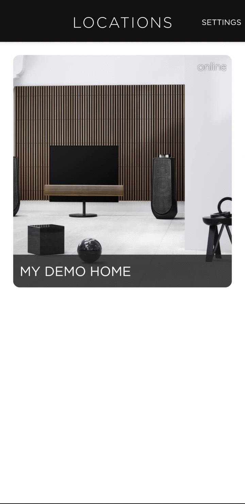
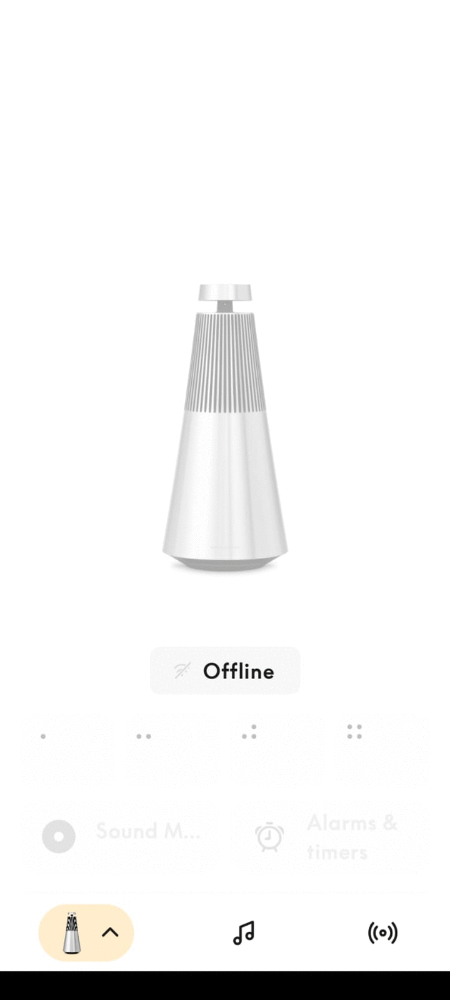

[comment]: <> (For a new horizontal slide use: \n----\n)
[comment]: <> (For a new vertical slide use: \n|||n)
[comment]: <> (To write slide notes use \nNote:)


## BeoLiving Intelligence
<!-- .slide: data-background-image="./res/shape.jpg" data-background-opacity="0.2" data-background-color="#010000" class="has-light-background" -->

##### by Khimo and Bang & Olufsen


<br/>
<small>Technical training</small>
<br/>
<small>Madrid, 2024-10</small>

----

<!-- .slide: data-background-image="./res/living4.png" data-background-opacity="0.2" data-background-color="#010000" class="has-light-background" -->
## Setup
| BLI  |  Philips HUE IP  | Halo SN | 
|---|---|---|
|  Unit 25  |  1  | |
|  Unit 82  |  1  | |
|  Unit 83  |  2  | |
|  Unit 58  |  2  | |

----
<!-- .slide: data-background-image="./res/living3.png" data-background-opacity="0.2" data-background-color="#010000" class="has-light-background" -->
## Technical Training: Exercise 1

<p> Build a quick setup with all the home resources, getting the UI automatically </p>

---

<!-- .slide: data-background-image="./res/living4.png" data-background-opacity="0.2" data-background-color="#010000" class="has-light-background" -->

<video id="videoBoston" controls autoplay data-autoplay mute style="width: 100%; max-width: 1024px; max-height: 75vw;">
  <source src="./assets/define_link_load.webm" type="video/webm">
  <source src="./assets/define_link_load.mp4" type="video/mp4">
</video>

----
<!-- .slide: data-background-image="./res/living3.png" data-background-opacity="0.2" data-background-color="#010000" class="has-light-background" -->
### Unboxing | First Steps

1. Connect to the network
1. Find on the network
2. Get access (Password reset)
3. Firmware upgrade


---

### 1 | Find on Network
<!-- .slide: data-background-image="./res/living3.png" data-background-opacity="0.2" data-background-color="#010000" class="has-light-background" -->

- Using the BeoLiving App

- On a network with a single BLI, from iOS, Android, MacOS, Linux: http://bli.local

Once we have the host, from any web browser (preferably CHROME) we enter: https://HOST/

---

<!-- .slide: data-background-image="./res/living3.png" data-background-opacity="0.2" data-background-color="#010000" class="has-light-background" -->

#### 1 | Find on Network: Using the BeoLiving App:


---

<!-- .slide: data-background-image="./res/living3.png" data-background-opacity="0.2" data-background-color="#010000" class="has-light-background" -->
#### User Button

Functions:
- **1**: Fire a BeoLiving Intelligence event
- **2**: Set _admin_ **password** to _"admin"_ (for 5 mins)
- **3**: **Fixed IP** (192.168.1.10).
- **4**: **DHCP**.
- **5**: <b style="color:orange">Erase</b> all configuration and settings.

---

<!-- .slide: data-background-image="./res/living2.png" data-background-opacity="0.2" data-background-color="#010000" class="has-light-background" -->

### 2 | Password Reset / Login

- Use USER BUTTON function 2 to RESET admin password 

|||

<!-- .slide: data-background-image="./res/living2.png" data-background-opacity="0.2" data-background-color="#010000" class="has-light-background" -->

<iframe width="560" height="315" src="https://www.youtube.com/embed/Xxjk1Tv4PM4?si=Y7gq-jEYym9Ae7HF" title="YouTube video player" frameborder="0" allow="accelerometer; autoplay; clipboard-write; encrypted-media; gyroscope; picture-in-picture; web-share" referrerpolicy="strict-origin-when-cross-origin" allowfullscreen></iframe>

|||
<!-- .slide: data-background-image="./res/living2.png" data-background-opacity="0.2" data-background-color="#010000" class="has-light-background" -->

Press and hold the button until the LED blinks twice in red, release the button, the LED will be flashing rapidly, tap on the button to confirm.

Now go into the browser and use user **admin** and password **admin**, this password will be valid for 5 minutes after the user button procedure.

Now define the password as  **khimo**.

-----

<!-- .slide: data-background-image="./res/living2.png" data-background-opacity="0.2" data-background-color="#010000" class="has-light-background" -->
### 3 | Home Structure, Areas, and Zones

- Go to "Admin -> Zones"

- Press "Add Area" 

- Set the area name to your city name

- Press the the "+" to add the zone

- Use your team name for the zone and choose a picture for it


---

<!-- .slide: data-background-image="./res/living.jpg" data-background-opacity="0.2" data-background-color="#010000" class="has-light-background" -->

### 4.1 Add Systems:

- Go to "Admin -> Systems"

- Press the "[+]" symbol in your zone 

- Add "Philips Hue CLIP" driver

Philips hue address: FIXME


---

<!-- .slide: data-background-image="./res/living4.png" data-background-opacity="0.2" data-background-color="#010000" class="has-light-background" -->
#### 4.2 | System: Link to BeoCloud: Integration PIN

FIXME: Create one integration PIN per group



---

<!-- .slide: data-background-image="./res/living2.png" data-background-opacity="0.2" data-background-color="#010000" class="has-light-background" -->


#### 5.1. Resources:  Mozart (B&O Control Link]

- "Admin -> Resources"

- "Control Link"

- [Show discovered resources]

- Add your product into your zone


   **NOTE:** Products can be assigned by SN or by IP.

---

<!-- .slide: data-background-image="./res/living3.png" data-background-opacity="0.2" data-background-color="#010000" class="has-light-background" -->
#### 5.2 Philips HUE: Resources

- "Resources" -> the team's zone -> Philips HUE

- [Load resources from connected systems]

- Import the resources into your zone


 Everyone must import the lights in their zone.

---

<!-- .slide: data-background-image="./res/living2.png" data-background-opacity="0.2" data-background-color="#010000" class="has-light-background" -->
#### 5.3. Halo

   This step should only be performed by the first team of the BLI. Using the same idea as in step 5.1 the team must define the Halo in their room.

---

<!-- .slide: data-background-image="./res/living.jpg" data-background-opacity="0.2" data-background-color="#010000" class="has-light-background" -->
### 6. We explore the interfaces and explore what we have learned:

- BeoLiving App

- Halo

- TV


---

<!-- .slide: data-background-image="./res/living1.png" data-background-opacity="0.2" data-background-color="#010000" class="has-light-background" -->
### 7. Configuration LifeCycle

- LIVE EDIT

- Powerful config history

- Tools -> Config


---

<!-- .slide: data-background-image="./res/living2.png" data-background-opacity="0.2" data-background-color="#010000" class="has-light-background" -->
### 8. Store Maintenance:

- Fixed IP DHCP 

or

- SN maintenance

----

<!-- .slide: data-background-video="./res/boston_experience_center_short.webm"   data-background-color="#aaa"  data-background-video-loop data-background-video-muted -->

### Take a break, time to relax?

----

<!-- .slide: data-background-image="./res/haloroom.png" data-background-opacity="0.2" data-background-color="#010000" class="has-light-background" -->
#### Exercise 2: Halo Playlist

- Go to "Interfaces -> Halo"

- Add one fancy button

- Create a macro with this button using AI


"Play the Beatles when the third button of the second page is pressed"

Note:
  - Task: create a Macro for halo
  - Task2: extend the macro to be visible in the APP/and TV (Intefaces/Zones).

----

<!-- .slide: data-background-image="./res/haloroom.png" data-background-opacity="0.2" data-background-color="#010000" class="has-light-background" -->
#### Exercise 3: Halo Volume

- Go to "Interfaces -> Halo"

- Add one volume behavior button

- Play with it!

Note:
  - Task: create a Volume behaivour Button
  - Test it!

---

<!-- .slide: data-background-video="./res/boston_experience_center_short.webm"   data-background-color="#aaa"  data-background-video-loop data-background-video-muted -->

#### Exercise 4: The BOSTON Experience: NFC 

- Install NFC driver

- Add READER resource

- Capture TAGS on MACROS


||||


<!-- .slide: data-background-image="./res/living4.png" data-background-opacity="0.2" data-background-color="#010000" class="has-light-background" -->

#### Advanced Use Cases: Boston Experience Center

<video id="videoBoston" controls autoplay data-autoplay style="width: 100%; max-width: 1024px; max-height: 75vw;">
  <source src="./res/boston_experience_center_short.webm" type="video/webm">
</video>

---

<!-- .slide: data-background-image="./res/comercial.jpg" data-background-opacity="0.2" data-background-color="#010000" class="has-light-background" -->

#### Exercise 5: Product Groups

<p> Let's create a product group </p>

---

<!-- .slide: data-background-image="./res/living4.png" data-background-opacity="0.2" data-background-color="#010000" class="has-light-background" -->

#### Exercise 6: Camera Support / Home Control Panel

```yml
FIXME: 
Camera IP:
Camera URL:
```

---

<!-- .slide: data-background-image="./res/haloroom.png" data-background-opacity="0.2" data-background-color="#010000" class="has-light-background" -->

#### Exercise 6: Khimo Remote Tunnel and Remote Specialists

<br/>
<a href="https://khimo.com/installer">khimo.com/installer</a>

<br/>
<small>One group per BeoLiving Intelligence invites a remote support specialist, and we test the remote access.</small>


---

<!-- .slide: data-background-video="./res/boston_experience_center_short.webm"   data-background-color="#111"  data-background-video-loop data-background-video-muted -->

#### Advanced: Exercise 7: Lua Dimmer Toggle

```lua
function(event, engine) 
    local result = engine.query("Main/Hall/DIMMER/Light")
    if result[1].get_number("LEVEL") == 0 then
   		Debug("Turning ON: Main/Hall/DIMMER/Light")
    	engine.fire("Main/Hall/DIMMER/Light/SET?LEVEL=100");
    else
   		Debug("Turning OFF: Main/Hall/DIMMER/Light")
      engine.fire("Main/Hall/DIMMER/Light/SET?LEVEL=0");
    end
end
```

Note:
  - Each team adapts the script to their DIMMER, making it works from the app
  - They can play use it from the app

---

<!-- .slide: data-background-video="./res/boston_experience_center_short.webm"   data-background-color="#111"  data-background-video-loop data-background-video-muted -->

#### Advanced: Exercise 7: Lua Dimmer Toggle

```lua
function(event, engine) 
    local result = engine.query("Main/Hall/DIMMER/Light")
    if result[1].get_number("LEVEL") == 0 then
   		Debug("Turning ON: Main/Hall/DIMMER/Light")
    	engine.fire("Main/Hall/DIMMER/Light/SET?LEVEL=100");
    else
   		Debug("Turning OFF: Main/Hall/DIMMER/Light")
      engine.fire("Main/Hall/DIMMER/Light/SET?LEVEL=0");
    end
end
```

---

<!-- .slide: data-background-image="./res/living1.png" data-background-opacity="0.2" data-background-color="#010000" class="has-light-background" -->

#### Documentation

<a href="https://khimo.github.io">khimo.github.io</a>

<a href="mailto:support@khimo.com">support@khimo.com</a>


---

## ROADMAP:

- Monitoring History
- Push Notifications
- Drivers
- Small Screens
- AI


<!-- .slide: data-background-image="./res/end.jpg" data-background-opacity="0.2" data-background-color="#010000" class="has-light-background" -->

# Thanks!

